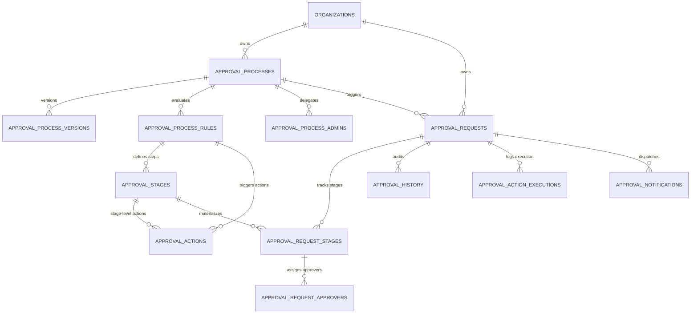

# Approval Process Database Schema & Architecture Guide

This document provides a comprehensive, detailed architectural and database explanation for the **Dynamic Approval Process Engine** (built following the Zoho CRM enterprise workflow architecture).

---

## 1. Architectural Overview

The approval system is decoupled into two fundamental layers:

1. **Configuration / Definition Layer (Design-time)**:
   Maintains the workflows, version history, execution rules, multi-stage approval hierarchies, delegated super-admins, and automated post-approval actions.
2. **Runtime / Execution Layer (Instance-time)**:
   Instantiated whenever an entity (e.g. Purchase Order, Job Order, Bill, Item) enters the approval funnel. Maintains an immutable lifecycle state, stage progress, approver responses, audit trails, and background action execution logs.

### Multi-Tenancy & Row-Level Security (RLS)
Every table includes `organization_id UUID NOT NULL` and enforces PostgreSQL Row-Level Security (`app.current_tenant` parameter) with foreign keys cascading on organization deletion.

---

## 2. Entity Relationship Diagram (ERD)



---

## 3. Configuration & Definition Tables

---

### 3.1 `approval_processes`
The parent workflow definition for a specific CRM module.

- **Prisma Model**: `ApprovalProcess`
- **Database Table**: `"approval_processes"`
- **Purpose**: Defines whether a module (e.g. `purchase_orders`) requires approval, its activation status, prioritization among competing processes, and execution trigger mode.

| Column | Data Type | Constraints & Defaults | Description |
| :--- | :--- | :--- | :--- |
| `id` | `UUID` | `PRIMARY KEY`, `gen_random_uuid()` | Unique identifier of the approval process. |
| `organization_id` | `UUID` | `NOT NULL`, `FK -> organizations.id` | Tenant organization boundary (RLS). |
| `name` | `VARCHAR(150)` | `NOT NULL` | Human-readable name of the approval process (e.g. "High Value PO Approval"). |
| `description` | `TEXT` | `NULLABLE` | Optional detailed documentation describing the business purpose of the process. |
| `module_id` | `VARCHAR(100)` | `NOT NULL` | CRM module identifier (e.g., `purchase_orders`, `bills`, `job_orders`, `items`). |
| `trigger_type` | `VARCHAR(50)` | `NOT NULL`, `DEFAULT 'CREATE_OR_EDIT'` | When the rule triggers: `CREATE`, `EDIT`, or `CREATE_OR_EDIT`. |
| `status` | `VARCHAR(30)` | `NOT NULL`, `DEFAULT 'DRAFT'` | Publication lifecycle: `DRAFT`, `ACTIVE`, `INACTIVE`. |
| `priority` | `INT` | `NOT NULL`, `DEFAULT 0` | Evaluation order when multiple processes exist for the same module. Higher priorities evaluate first. |
| `current_version` | `INT` | `NOT NULL`, `DEFAULT 1` | Incremental integer tracking the active published version number. |
| `is_deleted` | `BOOLEAN` | `NOT NULL`, `DEFAULT false` | Soft-delete flag for safe archival. |
| `created_by` | `UUID` | `NULLABLE`, `FK -> users.id` | User who created the workflow definition. |
| `updated_by` | `UUID` | `NULLABLE`, `FK -> users.id` | User who last updated the workflow definition. |
| `created_at` | `TIMESTAMPTZ(6)` | `NOT NULL`, `DEFAULT now()` | Record creation timestamp. |
| `updated_at` | `TIMESTAMPTZ(6)` | `NOT NULL`, `DEFAULT now()` | Last update timestamp. |

**Indexes**:
- `idx_approval_processes_org_module`: `("organization_id", "module_id", "status", "is_deleted")`
- `idx_approval_processes_priority`: `("organization_id", "module_id", "priority")`

---

### 3.2 `approval_process_versions`
Historical version snapshot store.

- **Prisma Model**: `ApprovalProcessVersion`
- **Database Table**: `"approval_process_versions"`
- **Purpose**: Preserves the exact configuration JSON (rules, criteria, stages, approvers, actions) at the moment a process is published. When a request is triggered, it links to the specific version to prevent in-flight approvals from breaking if a process is modified later.

| Column | Data Type | Constraints & Defaults | Description |
| :--- | :--- | :--- | :--- |
| `id` | `UUID` | `PRIMARY KEY`, `gen_random_uuid()` | Unique identifier for the snapshot. |
| `organization_id` | `UUID` | `NOT NULL`, `FK -> organizations.id` | Tenant organization boundary. |
| `process_id` | `UUID` | `NOT NULL`, `FK -> approval_processes.id` | The parent approval process. |
| `version_number` | `INT` | `NOT NULL` | Sequential version number (e.g. 1, 2, 3). |
| `snapshot` | `JSONB` | `NOT NULL` | Complete frozen JSON tree containing rules, stages, approvers, criteria, and actions. |
| `created_by` | `UUID` | `NULLABLE`, `FK -> users.id` | Author who published this version. |
| `created_at` | `TIMESTAMPTZ(6)` | `NOT NULL`, `DEFAULT now()` | Snapshot publication timestamp. |

**Indexes**:
- `idx_approval_process_versions_proc`: `("process_id", "version_number")`

---

### 3.3 `approval_process_rules`
Conditional logic criteria that determine if a record enters an approval process.

- **Prisma Model**: `ApprovalProcessRule`
- **Database Table**: `"approval_process_rules"`
- **Purpose**: Evaluates field conditions (e.g., `total_amount > 50000 AND vendor.rating < 3`). If satisfied, the record proceeds through the stages defined under this rule.

| Column | Data Type | Constraints & Defaults | Description |
| :--- | :--- | :--- | :--- |
| `id` | `UUID` | `PRIMARY KEY`, `gen_random_uuid()` | Unique rule identifier. |
| `organization_id` | `UUID` | `NOT NULL`, `FK -> organizations.id` | Tenant organization boundary. |
| `process_id` | `UUID` | `NOT NULL`, `FK -> approval_processes.id` | Associated parent approval process. |
| `name` | `VARCHAR(150)` | `NOT NULL`, `DEFAULT 'Rule 1'` | Descriptive rule name (e.g. "Capex Orders > 100k"). |
| `rule_order` | `INT` | `NOT NULL`, `DEFAULT 1` | Execution sequence order among sibling rules. |
| `criteria` | `JSONB` | `NOT NULL`, `DEFAULT '[]'` | Array of condition objects: `[{ field, comparator, value, type }]`. |
| `criteria_pattern`| `VARCHAR(255)` | `NOT NULL`, `DEFAULT '1'` | Boolean pattern for criteria evaluation (e.g. `(1 AND 2) OR 3`). |
| `is_deleted` | `BOOLEAN` | `NOT NULL`, `DEFAULT false` | Soft-delete flag. |
| `created_by` | `UUID` | `NULLABLE`, `FK -> users.id` | Author who created the rule. |
| `updated_by` | `UUID` | `NULLABLE`, `FK -> users.id` | Author who updated the rule. |
| `created_at` | `TIMESTAMPTZ(6)` | `NOT NULL`, `DEFAULT now()` | Record creation timestamp. |
| `updated_at` | `TIMESTAMPTZ(6)` | `NOT NULL`, `DEFAULT now()` | Last update timestamp. |

**Indexes**:
- `idx_approval_process_rules_proc`: `("process_id", "rule_order", "is_deleted")`

---

### 3.4 `approval_stages`
Individual approval steps/tiers under a rule.

- **Prisma Model**: `ApprovalStage`
- **Database Table**: `"approval_stages"`
- **Purpose**: Represents a single step in a multi-level approval pipeline (e.g., Stage 1: Department Manager, Stage 2: Finance Director).

| Column | Data Type | Constraints & Defaults | Description |
| :--- | :--- | :--- | :--- |
| `id` | `UUID` | `PRIMARY KEY`, `gen_random_uuid()` | Unique stage identifier. |
| `organization_id` | `UUID` | `NOT NULL`, `FK -> organizations.id` | Tenant organization boundary. |
| `rule_id` | `UUID` | `NOT NULL`, `FK -> approval_process_rules.id` | Parent rule defining this stage. |
| `name` | `VARCHAR(150)` | `NOT NULL`, `DEFAULT 'Stage 1'` | Name of stage (e.g. "Department Head Sign-off"). |
| `stage_order` | `INT` | `NOT NULL`, `DEFAULT 1` | Sequential order (1 = first stage, 2 = second stage, etc.). |
| `approver_type` | `VARCHAR(50)` | `NOT NULL`, `DEFAULT 'USER'` | `USER` (direct users), `ROLE` (members of a role), or `RECORD_OWNER_MANAGER`. |
| `approver_config` | `JSONB` | `NOT NULL`, `DEFAULT '{}'` | Payload storing configured user IDs, role IDs, or manager levels. Example: `{"userIds": ["uuid1", "uuid2"]}`. |
| `approval_mode` | `VARCHAR(50)` | `NOT NULL`, `DEFAULT 'ANYONE'` | How multiple approvers in this stage are evaluated: `ANYONE` (first to approve advances stage), `ALL` (everyone must approve), `SEQUENTIAL` (ordered one-by-one). |
| `assign_task_for_approvers` | `BOOLEAN` | `NOT NULL`, `DEFAULT false` | Whether to automatically create CRM tasks for the assigned approvers. |
| `record_modification_config`| `JSONB` | `NOT NULL`, `DEFAULT '{}'` | Permissions on whether the record can be edited while waiting in this stage. |
| `is_deleted` | `BOOLEAN` | `NOT NULL`, `DEFAULT false` | Soft delete flag. |
| `created_by` | `UUID` | `NULLABLE`, `FK -> users.id` | User who created the stage. |
| `updated_by` | `UUID` | `NULLABLE`, `FK -> users.id` | User who updated the stage. |
| `created_at` | `TIMESTAMPTZ(6)` | `NOT NULL`, `DEFAULT now()` | Stage creation timestamp. |
| `updated_at` | `TIMESTAMPTZ(6)` | `NOT NULL`, `DEFAULT now()` | Last update timestamp. |

**Indexes**:
- `idx_approval_stages_rule`: `("rule_id", "stage_order", "is_deleted")`

---

### 3.5 `approval_actions`
Automated workflows triggered at specific lifecycle checkpoints.

- **Prisma Model**: `ApprovalAction`
- **Database Table**: `"approval_actions"`
- **Purpose**: Configures automated actions executed on approval, rejection, or submission.

| Column | Data Type | Constraints & Defaults | Description |
| :--- | :--- | :--- | :--- |
| `id` | `UUID` | `PRIMARY KEY`, `gen_random_uuid()` | Unique action identifier. |
| `organization_id` | `UUID` | `NOT NULL`, `FK -> organizations.id` | Tenant organization boundary. |
| `rule_id` | `UUID` | `NOT NULL`, `FK -> approval_process_rules.id` | Associated rule. |
| `stage_id` | `UUID` | `NULLABLE`, `FK -> approval_stages.id` | Specific stage (if stage-level action) or `NULL` if rule/process-level action. |
| `trigger_event` | `VARCHAR(50)` | `NOT NULL`, `DEFAULT 'FINAL_APPROVAL'` | Lifecycle trigger: `SUBMIT`, `STAGE_APPROVAL`, `STAGE_REJECTION`, `FINAL_APPROVAL`, `FINAL_REJECTION`. |
| `action_type` | `VARCHAR(50)` | `NOT NULL` | Type of action: `EMAIL_ALERT`, `FIELD_UPDATE`, `WEBHOOK`, `TASK_CREATION`. |
| `action_config` | `JSONB` | `NOT NULL`, `DEFAULT '{}'` | Detailed payload (e.g. target field name and new value for field update, webhook URL and headers, email template ID). |
| `is_deleted` | `BOOLEAN` | `NOT NULL`, `DEFAULT false` | Soft-delete flag. |
| `created_by` | `UUID` | `NULLABLE`, `FK -> users.id` | Creator of the action. |
| `updated_by` | `UUID` | `NULLABLE`, `FK -> users.id` | Updater of the action. |
| `created_at` | `TIMESTAMPTZ(6)` | `NOT NULL`, `DEFAULT now()` | Record creation timestamp. |
| `updated_at` | `TIMESTAMPTZ(6)` | `NOT NULL`, `DEFAULT now()` | Last update timestamp. |

**Indexes**:
- `idx_approval_actions_rule`: `("rule_id", "trigger_event", "is_deleted")`

---

### 3.6 `approval_process_admins`
Delegated workflow administrators with elevated permissions.

- **Prisma Model**: `ApprovalProcessAdmin`
- **Database Table**: `"approval_process_admins"`
- **Purpose**: Maps users who hold Super-Approver / Rule Admin status for a given approval process. A Rule Admin can bypass, approve/reject at any stage, reassign approvers, or reconsider rejected requests.

| Column | Data Type | Constraints & Defaults | Description |
| :--- | :--- | :--- | :--- |
| `id` | `UUID` | `PRIMARY KEY`, `gen_random_uuid()` | Unique identifier. |
| `organization_id` | `UUID` | `NOT NULL`, `FK -> organizations.id` | Tenant organization boundary. |
| `process_id` | `UUID` | `NOT NULL`, `FK -> approval_processes.id` | Associated approval process. |
| `user_id` | `UUID` | `NOT NULL`, `FK -> users.id` | The admin user. |
| `can_override` | `BOOLEAN` | `NOT NULL`, `DEFAULT true` | If true, user can override approval decisions and approve on behalf of any stage approver. |
| `can_reassign` | `BOOLEAN` | `NOT NULL`, `DEFAULT true` | If true, user can reassign pending approval stages to other users. |
| `created_at` | `TIMESTAMPTZ(6)` | `NOT NULL`, `DEFAULT now()` | Assignment timestamp. |

**Constraints & Indexes**:
- `uq_approval_process_admin`: `UNIQUE ("process_id", "user_id")`
- `idx_approval_process_admins_user`: `("user_id")`

---

## 4. Runtime & Execution Tables

---

### 4.1 `approval_requests`
The primary instance table representing a live approval workflow for a specific CRM record.

- **Prisma Model**: `ApprovalRequest`
- **Database Table**: `"approval_requests"`
- **Purpose**: Tracks overall approval status for a submitted document (e.g. Purchase Order `PO-00028`), current stage progress, and requester information.

| Column | Data Type | Constraints & Defaults | Description |
| :--- | :--- | :--- | :--- |
| `id` | `UUID` | `PRIMARY KEY`, `gen_random_uuid()` | Unique approval request instance ID. |
| `organization_id` | `UUID` | `NOT NULL`, `FK -> organizations.id` | Tenant organization boundary. |
| `process_id` | `UUID` | `NOT NULL`, `FK -> approval_processes.id` | The approval process applied. |
| `process_version_id`| `UUID` | `NULLABLE`, `FK -> approval_process_versions.id` | Frozen version of the process used. |
| `rule_id` | `UUID` | `NULLABLE`, `FK -> approval_process_rules.id` | The specific matched rule whose stages are executed. |
| `module_id` | `VARCHAR(100)` | `NOT NULL` | Module identifier (`purchase_orders`, `bills`, etc.). |
| `record_id` | `VARCHAR(100)` | `NOT NULL` | Primary key of the underlying record. |
| `record_title` | `VARCHAR(255)` | `NOT NULL` | Friendly title for display (e.g. `PO #PO-00028`). |
| `record_snapshot` | `JSONB` | `NOT NULL`, `DEFAULT '{}'` | Full JSON snapshot of record values at time of submission. |
| `status` | `VARCHAR(50)` | `NOT NULL`, `DEFAULT 'PENDING'` | Global request status: `PENDING`, `IN_PROGRESS`, `APPROVED`, `REJECTED`, `CANCELLED`. |
| `current_stage_id`| `UUID` | `NULLABLE`, `FK -> approval_stages.id` | Pointer to the active stage definition. |
| `requester_id` | `UUID` | `NULLABLE`, `FK -> users.id` | The user who submitted the record for approval. |
| `submitted_at` | `TIMESTAMPTZ(6)` | `NOT NULL`, `DEFAULT now()` | Timestamp when submitted. |
| `completed_at` | `TIMESTAMPTZ(6)` | `NULLABLE` | Timestamp when final approval or rejection concluded. |
| `is_deleted` | `BOOLEAN` | `NOT NULL`, `DEFAULT false` | Soft-delete flag. |
| `created_by` | `UUID` | `NULLABLE`, `FK -> users.id` | Creator audit user. |
| `updated_by` | `UUID` | `NULLABLE`, `FK -> users.id` | Updater audit user. |
| `created_at` | `TIMESTAMPTZ(6)` | `NOT NULL`, `DEFAULT now()` | Record creation timestamp. |
| `updated_at` | `TIMESTAMPTZ(6)` | `NOT NULL`, `DEFAULT now()` | Last update timestamp. |

**Indexes**:
- `idx_approval_requests_record`: `("organization_id", "module_id", "record_id", "status")`
- `idx_approval_requests_requester`: `("requester_id", "status")`
- `idx_approval_requests_process`: `("process_id", "status")`

---

### 4.2 `approval_request_stages`
Materialized stage instances instantiated for a specific request.

- **Prisma Model**: `ApprovalRequestStage`
- **Database Table**: `"approval_request_stages"`
- **Purpose**: Holds the execution state of each stage (Order 1, Order 2, etc.) for that specific request.

| Column | Data Type | Constraints & Defaults | Description |
| :--- | :--- | :--- | :--- |
| `id` | `UUID` | `PRIMARY KEY`, `gen_random_uuid()` | Unique instance stage identifier. |
| `organization_id` | `UUID` | `NOT NULL`, `FK -> organizations.id` | Tenant organization boundary. |
| `request_id` | `UUID` | `NOT NULL`, `FK -> approval_requests.id` | Parent approval request instance. |
| `stage_id` | `UUID` | `NULLABLE`, `FK -> approval_stages.id` | Reference to configuration stage definition. |
| `stage_order` | `INT` | `NOT NULL`, `DEFAULT 1` | Step sequence (1, 2, 3...). |
| `name` | `VARCHAR(150)` | `NOT NULL` | Frozen name of the stage (e.g. "Stage 1: Lead Review"). |
| `status` | `VARCHAR(50)` | `NOT NULL`, `DEFAULT 'PENDING'` | Stage status: `PENDING`, `IN_PROGRESS`, `APPROVED`, `REJECTED`, `SKIPPED`. |
| `approval_mode` | `VARCHAR(50)` | `NOT NULL`, `DEFAULT 'ANYONE'` | `ANYONE`, `ALL`, or `SEQUENTIAL`. |
| `started_at` | `TIMESTAMPTZ(6)` | `NOT NULL`, `DEFAULT now()` | When this stage became active. |
| `completed_at` | `TIMESTAMPTZ(6)` | `NULLABLE` | When stage finished (approved/rejected/skipped). |

**Indexes**:
- `idx_approval_request_stages_req`: `("request_id", "stage_order")`

---

### 4.3 `approval_request_approvers`
Per-user approval assignments within an active stage.

- **Prisma Model**: `ApprovalRequestApprover`
- **Database Table**: `"approval_request_approvers"`
- **Purpose**: Maps which designated user has or has not acted on this stage, their decision, timestamp, review comments, and client audit metadata.

| Column | Data Type | Constraints & Defaults | Description |
| :--- | :--- | :--- | :--- |
| `id` | `UUID` | `PRIMARY KEY`, `gen_random_uuid()` | Unique approver assignment ID. |
| `organization_id` | `UUID` | `NOT NULL`, `FK -> organizations.id` | Tenant organization boundary. |
| `request_stage_id`| `UUID` | `NOT NULL`, `FK -> approval_request_stages.id` | Parent stage instance. |
| `user_id` | `UUID` | `NOT NULL`, `FK -> users.id` | Designated approver user. |
| `status` | `VARCHAR(50)` | `NOT NULL`, `DEFAULT 'PENDING'` | Decision status: `PENDING`, `APPROVED`, `REJECTED`, `SKIPPED`. |
| `action_taken_at` | `TIMESTAMPTZ(6)` | `NULLABLE` | Timestamp when user clicked Approve/Reject. |
| `comment` | `TEXT` | `NULLABLE` | Justification or reason entered by the user. |
| `ip_address` | `VARCHAR(45)` | `NULLABLE` | Client IP address for audit and compliance. |
| `user_agent` | `VARCHAR(255)` | `NULLABLE` | Client browser / device string. |

**Indexes**:
- `idx_approval_request_approvers_user`: `("user_id", "status")`
- `idx_approval_request_approvers_stage`: `("request_stage_id")`

---

### 4.4 `approval_history`
Immutable chronological audit log.

- **Prisma Model**: `ApprovalHistory`
- **Database Table**: `"approval_history"`
- **Purpose**: Permanent ledger of all actions taken on a request. Essential for ISO/SOC2 compliance, financial auditing, and forensic review.

| Column | Data Type | Constraints & Defaults | Description |
| :--- | :--- | :--- | :--- |
| `id` | `UUID` | `PRIMARY KEY`, `gen_random_uuid()` | Unique log entry ID. |
| `organization_id` | `UUID` | `NOT NULL`, `FK -> organizations.id` | Tenant organization boundary. |
| `request_id` | `UUID` | `NOT NULL`, `FK -> approval_requests.id` | Associated approval request. |
| `event_type` | `VARCHAR(80)` | `NOT NULL` | Event key: `SUBMITTED`, `STAGE_APPROVED`, `STAGE_REJECTED`, `RECONSIDERED`, `OVERRIDDEN`, `REASSIGNED`, `FINAL_APPROVED`, `FINAL_REJECTED`, `CANCELLED`. |
| `actor_id` | `UUID` | `NULLABLE`, `FK -> users.id` | User who triggered the action. |
| `previous_status` | `VARCHAR(50)` | `NULLABLE` | Status before this event. |
| `new_status` | `VARCHAR(50)` | `NULLABLE` | Status after this event. |
| `comment` | `TEXT` | `NULLABLE` | User comment or system reason. |
| `metadata` | `JSONB` | `NULLABLE`, `DEFAULT '{}'` | Additional payload (IP address, stage name, override details). |
| `created_at` | `TIMESTAMPTZ(6)` | `NOT NULL`, `DEFAULT now()` | Event timestamp. |

**Indexes**:
- `idx_approval_history_req`: `("request_id", "created_at")`

---

### 4.5 `approval_action_executions`
Execution tracker for automated background actions.

- **Prisma Model**: `ApprovalExecutedAction`
- **Database Table**: `"approval_action_executions"`
- **Purpose**: Guarantees at-least-once delivery for post-approval actions (webhooks, email alerts, field updates, tasks) and logs error messages for retries.

| Column | Data Type | Constraints & Defaults | Description |
| :--- | :--- | :--- | :--- |
| `id` | `UUID` | `PRIMARY KEY`, `gen_random_uuid()` | Unique execution log ID. |
| `organization_id` | `UUID` | `NOT NULL`, `FK -> organizations.id` | Tenant organization boundary. |
| `request_id` | `UUID` | `NOT NULL`, `FK -> approval_requests.id` | Associated approval request. |
| `action_id` | `UUID` | `NULLABLE`, `FK -> approval_actions.id` | The definition action executed. |
| `action_type` | `VARCHAR(50)` | `NOT NULL` | `EMAIL_ALERT`, `FIELD_UPDATE`, `WEBHOOK`, `TASK_CREATION`. |
| `trigger_event` | `VARCHAR(50)` | `NOT NULL` | The event that fired this action (`FINAL_APPROVAL`, etc.). |
| `status` | `VARCHAR(50)` | `NOT NULL`, `DEFAULT 'SUCCESS'` | `SUCCESS`, `FAILED`, `PENDING`, `RETRYING`. |
| `attempts` | `INT` | `NOT NULL`, `DEFAULT 1` | Retry counter. |
| `error_message` | `TEXT` | `NULLABLE` | Stack trace or HTTP error if failed. |
| `payload_sent` | `JSONB` | `NULLABLE` | Body sent to webhook or update service. |
| `response_received` | `JSONB`| `NULLABLE` | External response body. |
| `executed_at` | `TIMESTAMPTZ(6)` | `NOT NULL`, `DEFAULT now()` | Timestamp when execution was attempted. |
| `next_retry_at` | `TIMESTAMPTZ(6)` | `NULLABLE` | Scheduled retry timestamp if exponential backoff is triggered. |

**Indexes**:
- `idx_approval_action_executions_req`: `("request_id", "status")`

---

### 4.6 `approval_notifications`
In-app and alert notification queue for end users.

- **Prisma Model**: `ApprovalNotification` *(Defined in SQL migration)*
- **Database Table**: `"approval_notifications"`
- **Purpose**: Powers the user's notification bell and badge count (e.g. badge counter on the Approvals navigation bar).

| Column | Data Type | Constraints & Defaults | Description |
| :--- | :--- | :--- | :--- |
| `id` | `UUID` | `PRIMARY KEY`, `gen_random_uuid()` | Unique notification ID. |
| `organization_id` | `UUID` | `NOT NULL`, `FK -> organizations.id` | Tenant organization boundary. |
| `request_id` | `UUID` | `NOT NULL`, `FK -> approval_requests.id` | Associated approval request. |
| `recipient_id` | `UUID` | `NOT NULL`, `FK -> users.id` | The user receiving the alert. |
| `title` | `VARCHAR(255)` | `NOT NULL` | Short summary (e.g., "Approval Required for PO #PO-00028"). |
| `message` | `TEXT` | `NOT NULL` | Full notification body text. |
| `type` | `VARCHAR(50)` | `NOT NULL`, `DEFAULT 'APPROVAL_REQUIRED'`| Category: `APPROVAL_REQUIRED`, `APPROVED`, `REJECTED`, `REASSIGNED`. |
| `is_read` | `BOOLEAN` | `NOT NULL`, `DEFAULT false` | Has the user opened/dismissed this alert. |
| `created_at` | `TIMESTAMPTZ(6)` | `NOT NULL`, `DEFAULT now()` | Notification creation timestamp. |

**Indexes**:
- `idx_approval_notifications_recip`: `("recipient_id", "is_read")`

---

## 5. Lifecycle Flow & State Transitions

```
[Record Created / Edited]
         │
         ▼
[Evaluate Active Process Rules] ──(No Rule Matched / Rule Admin Bypass)──► [Record Auto-Approved]
         │
         ▼ (Rule Matches)
[Lock Record & Create approval_requests (Status: PENDING)]
         │
         ▼
[Materialize approval_request_stages & approval_request_approvers]
         │
         ▼
┌────────────────────────────────────────────────────────┐
│ Stage Evaluation Loop                                  │
│  - ANYONE: 1st approver advances stage                 │
│  - ALL: All must approve                               │
│  - SEQUENTIAL: Strict Order Approver 1 -> Approver 2   │
└──────────┬─────────────────────────────┬───────────────┘
           │                             │
    (Stage Approved)              (Any Approver Rejects)
           │                             │
   [Next Stage Exists?]                  ▼
    ├── Yes ──► [Advance Stage]   [Mark Request: REJECTED]
    └── No  ──► [FINAL_APPROVAL]  [Record Status: Rejected]
                     │                   │
                     │                   ▼
                     │            [Reconsider Option]
                     │            (Rejecting approver or Rule Admin
                     │             can trigger Reconsider)
                     ▼
             [Record Approved]
             [Execute Post-Approval Actions]
             [Log to approval_history]
```

---

## 6. Summary of Key Foreign Key Relationships

| From Table | Column | References | On Delete |
| :--- | :--- | :--- | :--- |
| `approval_processes` | `organization_id` | `organizations(id)` | `CASCADE` |
| `approval_process_versions` | `process_id` | `approval_processes(id)` | `CASCADE` |
| `approval_process_rules` | `process_id` | `approval_processes(id)` | `CASCADE` |
| `approval_stages` | `rule_id` | `approval_process_rules(id)` | `CASCADE` |
| `approval_actions` | `rule_id` | `approval_process_rules(id)` | `CASCADE` |
| `approval_actions` | `stage_id` | `approval_stages(id)` | `CASCADE` |
| `approval_process_admins` | `process_id` | `approval_processes(id)` | `CASCADE` |
| `approval_process_admins` | `user_id` | `users(id)` | `CASCADE` |
| `approval_requests` | `process_id` | `approval_processes(id)` | `CASCADE` |
| `approval_requests` | `rule_id` | `approval_process_rules(id)` | `SET NULL` |
| `approval_request_stages` | `request_id` | `approval_requests(id)` | `CASCADE` |
| `approval_request_stages` | `stage_id` | `approval_stages(id)` | `SET NULL` |
| `approval_request_approvers` | `request_stage_id`| `approval_request_stages(id)` | `CASCADE` |
| `approval_request_approvers` | `user_id` | `users(id)` | `CASCADE` |
| `approval_history` | `request_id` | `approval_requests(id)` | `CASCADE` |
| `approval_action_executions` | `request_id` | `approval_requests(id)` | `CASCADE` |
| `approval_notifications` | `request_id` | `approval_requests(id)` | `CASCADE` |
| `approval_notifications` | `recipient_id` | `users(id)` | `CASCADE` |
