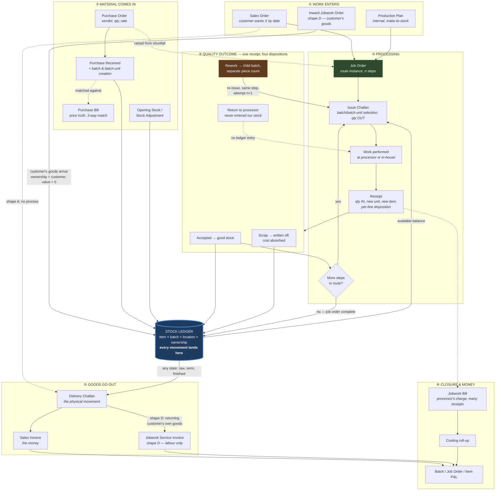
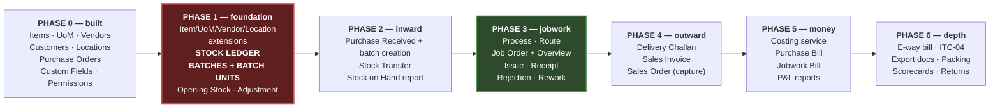

# Jobwork — Domain Flow & Module Map

> ### 🔴 2026-08-12 — "lot" is now "batch", and package tracking is gone
>
> **`lots` → `batches`** (plus `lot_number`/`supplier_lot_ref`/`parent_lot_ids`/`lot_id` →
> `batch_*`), a pure rename that changed no data. New numbers mint as `BATCH-00001`; numbers
> already on physical tags keep `LOT-`.
>
> **Package-level (per-taka) tracking was REMOVED end to end** — `lot_packages`, every
> `lot_package_id`, `parent_package_id`, `Process.preservesPackaging` and `JobReceipt.mode`.
> Quantity granularity stops at the batch. `Item.lot_tracking` went too; `inventory_tracking`
> (`none | batch`) is now the single tracking column and the item form writes it.
>
> **Text below about takas, packages, unit-wise receiving or `lot_packages` is HISTORY.** It is
> kept for the reasoning, which is where re-adding packages would start.

**Status:** design, pre-schema. No tables, no code. This document decides _what the modules are_,
_where the document boundaries fall_, and _in what order they get built_. Schema comes after this is
agreed, because the boundary decisions in §5 and §6 are what the schema is a consequence of.

**Source material:** the UFAPL mind map (textile jobwork: grey fabric → dyed → printed → cut →
garment), generalised to any jobworker. Where this document says "Batch Unit", the mind map says
"Taka"; where it says "Route", the mind map says "Job Process Template". The generic name is the one
that ships — the textile word becomes a per-org label (§5.2).

---

## 1. What the product has to cover

A jobworker is not a manufacturer and not a trader — they are both, intermittently, on the same
goods. The system has to hold **four business shapes at once**, and the schema must not privilege
one:

| #     | Shape                                                    | Goods owned by   | Revenue is            | Example                                                            |
| ----- | -------------------------------------------------------- | ---------------- | --------------------- | ------------------------------------------------------------------ |
| **A** | **Buy → sell as-is**                                     | Us               | Sale of goods         | Buy ready garments, sell them. No process at all.                  |
| **B** | **Buy → process → sell finished**                        | Us               | Sale of goods         | Buy grey fabric, dye + print + stitch, sell shirts.                |
| **C** | **Buy → process partly → sell mid-stream**               | Us               | Sale of goods         | Buy grey, dye it, sell dyed fabric without stitching.              |
| **D** | **Customer's goods → we process → return + bill labour** | **The customer** | Sale of a **service** | A mill sends us fabric, we dye it, we bill only the dyeing charge. |

**Shape D is the one that breaks naive designs.** In D the goods are on our floor, in our stock
report, moving through our processes — but they are _not our inventory_, they carry _zero value_ in
our books, and they must never appear in stock valuation or in cost of goods sold. Every design that
treats "stock" as "things we own" has to be torn up when D arrives.

The resolution is in §5.3: **ownership is a property of the batch, not of the module.** One flag, set
at the moment goods enter, carried by every downstream movement. Get that right on day one and D
costs almost nothing; retrofit it later and it touches every table.

Alongside those four, three mechanics recur and each drives a decision:

- **The unit changes across a process.** 100 SQFT of steel plate → 40 PCS. 500 METER of cloth → 300
  PCS of shirts. See §5.1 — this is _not_ unit conversion.
- **Goods sit at someone else's premises for weeks.** They are our asset, at their address. See §5.4.
- **Rejected goods go back out for rework and must be counted separately.** Not merged back into the
  original quantity, not double-counted as fresh production. See §5.5.

---

## 2. Vocabulary

Fixed here so the rest of the document, the schema, and the UI all use one word per concept.

| Term             | Means                                                                                                                                     | Not to be confused with                                         |
| ---------------- | ----------------------------------------------------------------------------------------------------------------------------------------- | --------------------------------------------------------------- |
| **Item**         | A distinct stockable thing, with exactly **one** stocking unit. "Grey fabric 60x60" and "Dyed fabric 60x60 red" are two items.            | A variant/spec — that's custom fields on the item               |
| **Batch**        | An identified quantity of one item that entered together and can be traced as a unit. Carries value, ownership, genealogy.                | Item — one item has many batches                                |
| **Batch Unit**   | An optional physical sub-package inside a batch: one roll, one taka, one bundle, one coil, one plate. Individually numbered and measured. | Batch — a batch has 1..n batch units                            |
| **Location**     | A physical place stock can be. Includes our godowns **and** each processor's premises **and** in-transit.                                 | Address on a vendor record                                      |
| **Process**      | A named operation: Dyeing, Printing, Cutting, Stitching, Laser, Galvanising. A master record.                                             | A step — the process is the _type_, the step is the _instance_  |
| **Route**        | An ordered list of processes with default processor + default rate + default in/out item & unit. A reusable template.                     | Job Order — a route is the template, a job order is the run     |
| **Job Order**    | One run of one route over one input quantity. Owns its steps.                                                                             | Route                                                           |
| **Step**         | One process inside one job order, with its own processor, rate, in/out item, in/out unit, and its own issued/received balance.            | Issue/Receipt — a step is the plan, those are the movements     |
| **Issue**        | A physical outward movement of material to a processor (or to an internal work centre) under a step. A challan.                           | Step — many issues per step                                     |
| **Receipt**      | A physical inward movement back from a processor under a step, with per-line disposition.                                                 | Issue — many receipts per issue                                 |
| **Stock Ledger** | The append-only record of every quantity movement. The single source of truth for "how much is where".                                    | A stock table — there is no balance table, balances are derived |
| **Disposition**  | What a received quantity _is_: accepted, rework, scrap, return-to-processor.                                                              | Status — disposition classifies goods, status tracks a document |

### 2.1 Invoice, Bill, Challan — three words, three different things

An invoice and a bill are usually **the same piece of paper recorded twice, in two companies'
systems**. Your vendor's invoice _is_ your bill: they booked revenue, you book cost.

|           | **Invoice**                | **Bill**                   | **Challan**           |
| --------- | -------------------------- | -------------------------- | --------------------- |
| Direction | You **issue** it           | You **receive** it         | Either                |
| Creates   | Account **Receivable**     | Account **Payable**        | **Nothing financial** |
| P&L       | Revenue                    | Cost                       | None                  |
| GST       | **Output** tax you collect | **Input** credit you claim | No supply at all      |
| Cycle     | O2C                        | P2P                        | Movement only         |

The naming split is not universal — SAP and Tally say "invoice" on both sides with a qualifier. This
product follows the **Zoho / QuickBooks / Xero convention** (Invoice outbound, Bill inbound), because
the stack is Catalyst, the `Item` schema already mirrors Zoho Inventory's field set, and the mind map
itself writes _"Purchase Module (Bill)"_.

**They are two tables, never one with a direction flag:**

- **The number is yours vs theirs.** Your invoice number comes from `NumberSequence` and must be
  gapless and sequential for GST. A vendor's bill number is _their_ string — free text, unique per
  vendor, and you cannot generate it.
- Different party FK (customer vs vendor), different tax treatment (output liability vs input
  credit, filed in different returns), different lifecycle.

One table with a flag means every query in the system carries a direction filter it can forget.

🔴 **The challan is the one this domain adds, and it is a legal distinction, not a naming one.**
Under Indian GST, sending goods to a job worker is **not a supply** — it moves on a delivery challan
under Rule 55 and is reported in ITC-04. Issuing a tax invoice for it would be wrong. That is why
§6.1 keeps Delivery Challan and Sales Invoice as two documents: a jobwork return challan must be able
to exist with **no invoice behind it, ever**.

Two more that are neither, both in the mind map's export block: a **proforma invoice** has no
accounting effect (a quote in an invoice's clothing), and a **commercial invoice** is a customs
document, not an accounting one.

---

## 3. The end-to-end flow

### 3.1 Diagram



### 3.2 The ordered flow, with actors and documents

Read this as the plant reads it. "Owner" is the entity that owns the record.

| #       | Step                                                                | Actor              | Document                     | What the system records                                                                                                                                                                   | Owning entity                                       |
| ------- | ------------------------------------------------------------------- | ------------------ | ---------------------------- | ----------------------------------------------------------------------------------------------------------------------------------------------------------------------------------------- | --------------------------------------------------- |
| **1**   | Customer places an order, **or** planner decides to build for stock | Sales / Planner    | **Sales Order** (or none)    | Customer, item, qty, rate, delivery date, linked route                                                                                                                                    | `SalesOrder` + `SalesOrderLine`                     |
| **1b**  | _(Shape D)_ Customer sends **their** goods for processing           | Sales              | **Inward Jobwork Order**     | Customer, item, qty received, agreed process + rate, return-by date                                                                                                                       | `JobOrder` with `ownership = customer`              |
| **2**   | Check what stock exists; decide buy vs issue from stock             | Planner            | — (screen, not a document)   | Nothing new — a derived availability read                                                                                                                                                 | _(query over `StockLedger`)_                        |
| **3**   | Raise purchase for the shortfall                                    | Purchase           | **Purchase Order** ✅*built* | Vendor, branch, item, qty, rate, GST, broker, payment terms, delivery days, transport                                                                                                     | `PurchaseOrder` + `PurchaseOrderItem`               |
| **4**   | Material arrives at the gate                                        | Store              | **Purchase Received**        | Receipt no/date, PO ref, location, transport, LR no/date, item, qty received vs ordered, **batch number**                                                                                 | `PurchaseReceipt` + `PurchaseReceiptLine`           |
| **5**   | Store breaks the receipt into physical packages                     | Store              | _(inside Purchase Received)_ | Per-package: batch-unit number (auto or manual), qty, unit                                                                                                                                | `Batch` + `BatchUnit`                               |
| **6**   | Stock becomes available                                             | _(system)_         | —                            | One ledger row per batch-unit: `+qty`, location, ownership, value                                                                                                                         | `StockLedger`                                       |
| **7**   | Supplier's bill arrives, prices verified                            | Accounts           | **Purchase Bill**            | Bill no/date, PO + receipt refs, rate, GST, freight → **landed cost** back onto the batch                                                                                                 | `PurchaseBill` + `PurchaseBillLine`                 |
| **8**   | Decide the processing path                                          | Production         | **Job Order**                | JO no/date, input item + qty, route (auto from item or manual), source SO, target completion                                                                                              | `JobOrder`                                          |
| **9**   | Route expands into steps                                            | _(system)_         | _(inside Job Order)_         | Per step: sequence, process, processor, rate + rate basis, **issue item + unit**, **receive item + unit**, expected yield, tolerance %, in-house flag                                     | `JobOrderStep`                                      |
| **10**  | Material physically leaves for step 1                               | Store              | **Issue Challan**            | Challan no/date, JO + step, processor, **selected batches & batch-units**, qty per unit, total, e-way bill ref, transporter                                                               | `JobIssue` + `JobIssueLine`                         |
| **11**  | Stock moves out of our godown, not out of our books                 | _(system)_         | —                            | `−qty` at our location, `+qty` at the **processor's location**. Ownership unchanged. Value unchanged.                                                                                     | `StockLedger`                                       |
| **12**  | Processor performs the operation                                    | Processor          | _(their internal)_           | Nothing until receipt                                                                                                                                                                     | —                                                   |
| **13**  | Processed goods come back                                           | Store              | **Receipt**                  | Receipt no/date, issue ref, **received item** (may differ), **received qty in the received unit** (may differ), per batch-unit or bulk, wastage, **disposition per line**                 | `JobReceipt` + `JobReceiptLine`                     |
| **14**  | Variance is computed and checked                                    | Store / QC         | _(inside Receipt)_           | Issued qty, received qty, difference, wastage %, tolerance breach flag + who approved it                                                                                                  | `JobReceiptLine`                                    |
| **15**  | Output becomes stock                                                | _(system)_         | —                            | `−issued qty` of input item at processor location; `+received qty` of **output item** at our location. New **child batch**, parent = input batches. Value = input value + process charge. | `StockLedger` + `Batch`                             |
| **16**  | Rejected quantity is classified                                     | QC                 | _(inside Receipt)_           | Rework / scrap / return-to-processor + reason + responsibility (ours vs theirs)                                                                                                           | `JobReceiptLine.disposition`                        |
| **17**  | Rework goes back out                                                | Store              | **Issue Challan** (new)      | New challan, **same step**, `attemptNo = n+1`, rework child batch, rate may be ₹0 if processor's fault                                                                                    | `JobIssue` (`isRework = true`)                      |
| **18**  | Repeat 10–17 for every remaining step                               | Store / Production | —                            | Step status advances; cost accumulates per step                                                                                                                                           | `JobOrderStep.status`                               |
| **19**  | Final step received → job order closes                              | Production         | —                            | JO status → `completed` (or `short_closed` if diverted/cancelled part-way)                                                                                                                | `JobOrder.status`                                   |
| **20**  | Processor's bill arrives                                            | Accounts           | **Jobwork Bill**             | Their bill no, receipts covered, qty billed vs received, rate, GST, TDS                                                                                                                   | `JobworkBill` + lines                               |
| **21**  | Finished (or semi-finished, or untouched) goods dispatched          | Dispatch           | **Delivery Challan**         | DC no/date, customer, **batches & batch-units dispatched**, qty, vehicle, e-way bill, packing detail                                                                                      | `DeliveryChallan` + lines                           |
| **22**  | Customer is billed                                                  | Accounts           | **Sales Invoice**            | Invoice no/date, DC refs, item, qty, rate, GST, terms                                                                                                                                     | `SalesInvoice` + lines                              |
| **22b** | _(Shape D)_ Customer's own goods returned + labour billed           | Accounts           | **Jobwork Service Invoice**  | Process charge only. Goods leave at zero value.                                                                                                                                           | `SalesInvoice` with `invoiceType = jobwork_service` |
| **23**  | Margin is known                                                     | Accounts           | _(reports)_                  | Sale value − (material + process + wastage + rework + freight)                                                                                                                            | _(derived from `StockLedger` + cost rows)_          |

**Actors, consolidated:** Sales · Planner/Production · Purchase · Store/Gate · QC · Dispatch ·
Accounts · Processor (external, no login in v1) · Broker (referenced, no login).

### 3.3 Which comes first — Purchase Order or Sales Order?

**Neither. They are two independent cycles that meet at inventory, never at a document.** That is the
standard in every mainstream ERP — SAP, Oracle, Dynamics, NetSuite, Odoo, Zoho:

```
P2P  (Procure to Pay)     Requisition → RFQ → PO → Purchase Received → Bill → Payment
                                                           ↓
                                                       INVENTORY
                                                           ↓
O2C  (Order to Cash)      Quotation → SO → Delivery Challan → Invoice → Payment Receipt
```

Most ERPs name that fourth P2P step a **GRN** (Goods Receipt Note). Same document — this product uses
the plant's own words, which is what the mind map already called it. O2C's last step is a _payment_
receipt and has nothing to do with the jobwork **Receipt** in §3.2; both names are load-bearing, so
neither may appear bare as "Receipt" in a screen title or a status value.

Which one is _created_ first depends on fulfilment strategy, and this product must support all four
rows — so neither may be made a prerequisite of the other:

| Strategy                          | First document                                                          | Which of our shapes  |
| --------------------------------- | ----------------------------------------------------------------------- | -------------------- |
| **Make/Buy-to-Stock**             | **PO** — buy on forecast, sell later from stock                         | Shape A (trading)    |
| **Make-to-Order**                 | **SO** — customer commits, then procure and produce                     | Shapes B and C       |
| **Purchase-to-Order / drop-ship** | **SO**, and the PO is generated from it and stays linked                | Back-to-back trading |
| **Inward jobwork**                | **Neither** — no PO (we didn't buy) and no SO (we're not selling goods) | Shape D              |

**The link is one-directional and optional.** A PO _may_ reference an SO — "I'm buying this _for_
that order" (SAP: third-party order processing; NetSuite: special order; Odoo: the MTO route). An SO
**never** requires a PO. `PurchaseOrderItem.linked_sales_order_id` already exists in the schema,
unused — that column is exactly this link, already anticipated.

The textbook path from demand to purchase is longer still — MRP → planned order → purchase
requisition → RFQ → PO. A jobworker needs neither requisitions nor RFQs, but the principle survives:
**demand suggests a PO, it never creates one automatically.**

🔴 **A Job Order carries an _optional_ `sourceSalesOrderId`.** Make it required and you break shape A
and every jobworker who starts from a phone call — which is most of them.

**Build order follows from a dependency, not a preference:** selling requires stock to exist; buying
does not require a sale to exist. Purchase Received is the only way stock enters the system, so the
inward path must work before the outward path has anything to operate on. Hence Purchase Received in
phase 2, Sales Order in phase 4 as capture-only (§11).

Note that both documents are _intentions_ — **neither touches stock.** The PO does not create stock
(Purchase Received does) and the SO does not remove it (the Delivery Challan does). That is why both are
low-risk to build, and why the Stock Ledger still precedes either.

---

## 4. Where the flow is not linear

Three things the diagram flattens but the plant does not:

1. **Steps 10–17 are a loop with a variable trip count.** One step can have many issues (material
   sent in batches), each issue many receipts (goods come back in batches), and any receipt can spawn
   a rework issue against the same step. The schema must never assume 1 issue = 1 receipt.
2. **A job order can be abandoned mid-route** and its semi-finished output sold (shape C). The
   remaining steps are not deleted — they are `cancelled`, and the job order becomes `short_closed`.
   The cost that was accumulated stays on the batch and is recovered against the mid-stream sale.
3. **Some steps are in-house.** Same `JobOrderStep`, `processorType = internal`, issue moves stock to
   an internal work-centre location, cost is a labour/overhead rate instead of a vendor rate, and no
   e-way bill or jobwork challan is generated. The mind map lists this as a use case; treating it as
   a flag rather than a parallel module is what keeps the costing roll-up uniform.

---

## 5. The seven load-bearing decisions

These are the choices the schema is downstream of. Each is stated with its rejected alternative,
because the rejected one is the intuitive one.

### 5.1 Unit conversion and process transformation are two different mechanisms

The requirement "item can be given in one unit and returned in a different unit" is actually two
unrelated requirements wearing one sentence. Conflating them is the single most expensive mistake
available here.

|                | **Transaction UoM conversion**                      | **Process transformation**                                              |
| -------------- | --------------------------------------------------- | ----------------------------------------------------------------------- |
| Example        | Stock in METER, issue in KG                         | 100 SQFT plate → 40 PCS bracket                                         |
| Item           | **Same** item throughout                            | **Different** item in and out                                           |
| Ratio          | **Fixed**, known in advance, a property of the item | **Discovered at receipt**, varies per batch, per processor, per attempt |
| Where it lives | `ItemUomConversion` (item, altUom, factor)          | `JobOrderStep` declares intent; `JobReceipt` records actuality          |
| What it means  | Same physical stock, different arithmetic           | Old stock destroyed, new stock created                                  |
| If wrong       | A number is off                                     | Stock is silently invented or destroyed                                 |

**Rule: one item has exactly one stocking unit.** If the unit of a thing changes because the thing
changed, it is a **different item**. Raw steel plate (SQFT) and cut bracket (PCS) are two items.
Cloth (METER) and shirt (PCS) are two items.

This is exactly the mind map's `Process → Item Changed? → if True → New Item Name`, and it is what
makes the stock ledger tractable: a balance is always one number in one unit, never a pair that has
to be reconciled.

- **Rejected:** letting an item hold stock in several units at once. Then "how much do we have" has
  no answer, only a list, and every valuation needs a conversion that does not exist for
  discovered-ratio cases.
- **Consequence:** a step names its items and their units explicitly, and the route template supplies
  the defaults. The mind map's "Send Item Unit / Receive Item Unit" on the template is exactly this.
  Those are **lists**, not single fields — see §5.7.
- **Yield** = received qty ÷ issued qty, in mixed units (0.4 PCS/SQFT). Store the expected on the
  step, compute the actual on the receipt, alert on the gap. Never treat it as a conversion factor.
- ⚠️ **The conversion factor is not always a property of the item.** Fabric is bought by weight and
  sold by length, and the kg ↔ metre factor depends on that roll's actual GSM and width — so it
  varies **per batch**, not per item. The mind map flags this as _"Rate (Confusion): Pcs / Meter / Kg"_.
  `ItemUomConversion` therefore needs a **batch-level override**: item-level factor as the default,
  optionally overridden on the batch at Purchase Received time. Without it, weight-based purchase and
  length-based sale of the same fabric cannot both be right.

### 5.2 Batch and Batch Unit — the traceability spine

> ⚠️ **HISTORY as of 2026-08-12.** Batch units / packages were removed end to end — quantity
> granularity stops at the batch. This section is kept deliberately: it is the reasoning that
> decided where the boundary sits, and re-adding per-taka tracking would start here.

- A **Batch** is the traceable quantity. It carries value, ownership, genealogy (`parentBatchIds`),
  and current state. Every movement references a batch.
- A **Batch Unit** is the physical package inside it — the taka, roll, bale, coil, plate, bundle. It
  has its own number and its own measured quantity. The mind map's "Taka Allocation" screen, with
  auto-numbering `Batch-1, Batch-2, …`, is batch-unit creation.
- The word "Taka" is a **per-org label** on batch units (Taka / Roll / Bale / Coil / Plate / Bundle),
  not a table name. Textile is the first customer, not the product.

**Genealogy is the traceability answer.** Because items change identity across processes, you cannot
trace by item. You trace by batch parentage: shirt batch `BATCH-00101` ← `BATCH-00088` ← `BATCH-00075` ←
`BATCH-00061` ← `BATCH-00040` ← `BATCH-00012` ← PR-0007 ← PO-0031 ← Sunrise Mills. Forwards and backwards,
both directions, from one table. Worked end to end in **Appendix A**.

#### 5.2.1 Which is mandatory

**A Batch is mandatory internally, optional in the UI.** Every ledger row references a batch — there is
no nullable batch — because four things depend on it: value lives on the batch (§9.1), genealogy _is_ batch
parentage, ownership (§5.3) is a batch property, and a process creates a genuinely new thing that needs
an identity. But whether the _user_ sees it is per item: `Item.inventoryTracking = none | batch |
batch_and_unit`. With `none` the system silently creates one batch per receipt and no batch field ever
appears on screen; costing and the ledger still work. Use it for thread, buttons, dye chemicals,
packing tape, machine oil, services — forcing a batch number there is how a system gets abandoned.

**A Batch Unit is genuinely optional, and often wrong to have.** One question decides it:

> **Do individual packages have _different_ quantities that must be recorded separately?**

|                                               | Batch units? | Why                                                            |
| --------------------------------------------- | ------------ | -------------------------------------------------------------- |
| 40 rolls of fabric — 98.5 m, 103.2 m, 96.8 m… | **Yes**      | Every roll differs; the number _is_ the measurement's identity |
| 10 identical 50 kg bags of dye                | **No**       | Interchangeable — 500 kg ÷ 50 says everything                  |
| 5,000 buttons                                 | **No**       | The unit _is_ the button                                       |
| 200 steel plates, each cut to size            | **Yes**      | Each carries its own dimensions                                |
| 2,000 litres of solvent                       | **No**       | Continuous, no packages                                        |

If every package is identical, numbering them is data entry with no information in it.

#### 5.2.2 Numbering

|               | Batch                                                             | Batch Unit                          |
| ------------- | ----------------------------------------------------------------- | ----------------------------------- |
| Sequence      | **One global sequence per org** — `NumberSequence`, already built | **Restarts at 1 inside each batch** |
| Example       | `BATCH-00088`                                                     | `BATCH-00088/1 … /40`               |
| Unique across | The organization                                                  | Its parent batch                    |
| Manual entry  | **Allowed** — mills carry the supplier's number or a physical tag | Allowed                             |

Scoped numbering is correct exactly when the parent is guaranteed, singular and permanent. A batch unit
always has exactly one parent batch, can never merge across batches, and cannot exist without one — so it
gets a scoped sequence. A batch has **zero, one, or many** parents, so it cannot.

🔴 **The batch number carries no meaning. Never infer anything from it.** A child batch always has a
higher number than its parents — but only because it was created later, not because of the
relationship. Gaps mean unrelated business happened in between. Concurrent job orders interleave
(`BATCH-00040` and `BATCH-00043` are one chain; `BATCH-00041` and `BATCH-00042` are a different one), rework
branches out of sequence, and go-live migration assigns numbers in import order rather than business
order. Parentage lives **only** in `parentBatchIds`.

**Do not bind the batch number to the PO** (`PO-3/L-1, L-2, …`). It looks helpful and fails on contact:

- **~5 of every 6 batches have no PO at all** — every process step creates one (dyed, printed, cut,
  stitched), as do rework, opening stock, adjustments, sales returns, and _all_ of shape D. A
  PO-bound scheme needs a second scheme for the majority, so users learn two.
- **Merges have no valid answer.** Grey from PO-3 and PO-7 dyed together return as one batch. Which
  sequence? An identifier holds one relationship; real batches have zero, one, or many.
- **It answers a query with an identifier.** "How many batches came from PO-3?" is
  `WHERE source_doc_type='purchase_receipt' AND source_po_id=:id` — which also survives partial
  deliveries across several receipts, and walks the genealogy to answer "which _shirts_ came from
  PO-3?", something a PO-bound number can never do.
- **Numbers must be stable.** A batch number gets printed on a tag stuck to a roll. Re-assigning a
  mis-recorded PO must never renumber it.

Serve the underlying need with **`Batch.supplierBatchRef`** — free text holding the vendor's own
batch/batch number or whatever the physical tag says. Searchable, no uniqueness constraint, no effect
on numbering. This generalises well beyond textile: steel's **heat number** (the mill's melt batch, a
legal traceability requirement for structural steel) lands in exactly this field. Then show the count
where people look for it: a **Batches tab on the PO detail page** (`PO-0031 · 12 batches · 5,000.00 MTR`).

#### 5.2.3 Batch units need parentage too — but only sometimes

> ⚠️ **HISTORY as of 2026-08-12.** Batch units / packages were removed end to end — quantity
> granularity stops at the batch. This section is kept deliberately: it is the reasoning that
> decided where the boundary sits, and re-adding per-taka tracking would start here.

Taka-wise receipt (§8.4) matches _issued_ package to _returned_ package one-to-one, with a wastage
figure per package. That mapping is `BatchUnit.parentBatchUnitId`. It only exists when the physical
package survives the operation:

- **Dyeing** — the roll goes, the same roll returns. Unit parentage exists; taka-wise receipt works.
- **Cutting** — rolls are destroyed, bundles are created. No 1:1 mapping; only bulk receipt is
  possible.

So taka-wise vs bulk is **not a user preference** — it is determined by the process. Put
`preservesPackaging` on the Process master and let the receive dialog offer only the mode that is
physically possible, rather than letting someone pick an impossible one.

#### 5.2.4 Shade batch matching

Fabric dyed in different batches carries visible shade variation. Cutting a garment's body from dye-batch
A and its sleeves from dye-batch B produces a reject that **no inspection catches until the garment is
assembled**. So some steps must draw from a **single batch**, and mixing has to be blocked at issue
time — `Process.requiresSingleBatch`.

This is a genuine business rule, not a nicety, and the same shape recurs outside textile wherever
material properties vary by batch: dye shade, steel heat, paper brightness, plastic colour masterbatch.

### 5.3 Ownership belongs to the batch — this is what makes shape D nearly free

```
Batch.ownership   = own | customer
Batch.ownerPartyId = <customer id, when ownership = customer>
```

Everything follows from that one pair:

|                                       | `ownership = own`                | `ownership = customer`                     |
| ------------------------------------- | -------------------------------- | ------------------------------------------ |
| Appears in stock **quantity** reports | Yes                              | Yes, segregated                            |
| Appears in stock **valuation**        | Yes                              | **No — always zero value**                 |
| Material cost enters COGS             | Yes                              | **No**                                     |
| Revenue on exit                       | Sale of goods                    | Sale of **service** (process charge)       |
| Document on exit                      | Delivery Challan + Sales Invoice | Delivery Challan + Jobwork Service Invoice |
| Process cost                          | Capitalised into the batch       | Expensed against the service revenue       |

- **Rejected:** a separate "customer stock" module, or a separate set of jobwork tables. That
  duplicates the ledger, the batch logic, the issue/receipt flow and the reports — and the two copies
  drift within a quarter.
- **Consequence:** every valuation query filters `ownership = 'own'`. Every quantity query does not.
  Write that rule down once, in one service, and never inline it.
- **Nested case works too:** we receive a customer's goods (shape D) and send them on to a
  sub-processor. Ownership stays `customer` through the whole chain. No special handling.

### 5.4 Goods at a processor are our stock at their location

Two candidate designs:

- **(a)** One axis — `Location`, extended with `type = processor` and a `vendorId`/`customerId` link.
  Each job-work counterparty gets an auto-created location the first time they are used.
- **(b)** Two axes — the ledger carries both a location and a separate `stockState`
  (in-house / with-processor / in-transit).

**Choose (a).** The ledger stays single-axis, "where is it" has one answer, transfers between our own
godowns and transfers to a processor are the same operation, and the Locations module already exists
and already supports hierarchy. (b) adds an axis that must be kept consistent with the first one,
and inconsistency between them is unobservable.

- **Consequence:** `Location.type` gains `processor` and `in_transit`; `Location` gains an optional
  link to the vendor or customer it represents. Marked **needs-extending** in §7.
- **This is what makes the "stock lying with processors" report a plain ledger query** — grouped by
  location, aged by movement date. For Indian GST that report is not a nicety: goods must return
  within 180/365 days or the input credit reverses, and ITC-04 has to be filed. Ageing must be
  available from release 1.

### 5.5 Rework is a new issue against the same step, and a child batch

The requirement — _"if some items are damaged then can give again for rework and it should be count
as separate pieces"_ — decomposes into three decisions:

1. **Rejection is not a document.** It is a `disposition` on a receipt line. The goods came back in
   one physical event; splitting that event across two documents means the two can disagree about how
   much came back. One receipt, lines classified `accepted` / `rework` / `scrap` /
   `return_to_processor`, quantities summing to the received total.
2. **Rework re-issue _is_ a document.** Goods physically leave again → new challan number, new e-way
   bill, new date, possibly a different processor. It is a `JobIssue` with `isRework = true`,
   `attemptNo = n+1`, against the **same** `JobOrderStep`. Not a new job order (the order did not
   change), not a new step (the process did not change).
3. **Rework quantity becomes a child batch.** This is the "count as separate pieces" requirement, and
   it is load-bearing. If rework merges back into the parent batch, you lose: how many pieces were made
   twice, which processor caused it, what the rework cost was, and whether a piece has been reworked
   three times. A child batch with `sourceReceiptLineId` and `attemptNo` gives all four for free, and
   good stock is never inflated by counting a piece as produced twice.

**Rejection responsibility drives money, so record it:** `ours` (we absorb the cost, and pay the
processor again for rework) vs `theirs` (they redo at zero rate, or we debit them). One field,
`responsibility`, on the rejection line. Without it, wastage analysis and vendor scorecards are both
guesswork.

**Scrap** is a ledger write-off, not a deletion: `−qty`, reason `scrap`, and the cost stays absorbed
in the job order so the surviving good pieces carry the true cost of the failures.

### 5.6 Balances are derived, never stored

The stock ledger is **append-only**. There is no `stock_balance` table that gets `UPDATE`d.

- Availability = `SUM(qtyIn − qtyOut)` grouped by item × batch × location × ownership.
- A corrected mistake is a **reversing entry**, never an edit or a delete.
- **Cancelling a posted document does not delete its rows** — it posts the opposite rows and flips
  the document status. History survives; the balance is still right.
- Performance: index on `(organizationId, itemId, batchId, locationId)` and add a materialised
  balance view only when a real query proves it necessary. Do not pre-optimise a correctness
  guarantee away.

This is the same reasoning that made `refresh_tokens` a retained log rather than a table rows are
deleted from — a mutable balance loses the one thing an audit needs, and "how did we get here" is the
question every stock dispute actually asks.

### 5.7 A step consumes a SET of items and produces a SET of items

_(Decided 2026-08-06. Supersedes the one-in-one-out reading of §5.1 everywhere in this document.)_

Stitching does not take panels. It takes panels **and thread and buttons**, and it returns shirts
**and** the pieces that failed inspection. Cutting returns panels **and** offcuts **and** waste.

```
Step 4  Stitching
  in    Cut Panels   2,910 PCS      out   Shirts    2,880 PCS
        Thread          12 CONE           Rejects      15 PCS
        Buttons      8,700 PCS
```

So a step carries **two lists**, not four fields, and a receipt records **two lists** — what it
consumed and what came back. Those lists have different lengths and different units, which is why
they cannot share one table.

- **Rejected:** one input and one output per step, with consumables tracked outside the job order.
  Thread and buttons are stock; issuing them without a challan means they leave the godown with no
  document, and their cost never reaches the garment. It also puts a second, invisible stock path
  beside the ledger — the one thing §13 forbids.
- **Rejected:** a step per input item (one for thread, one for buttons). They are one physical
  operation performed once, by one processor, on one challan. Splitting them multiplies the
  paperwork by the bill of materials and makes the step statuses disagree about whether stitching
  happened.

Four consequences, each of which changes something that used to be simple:

1. **`§5.1`'s rule survives untouched.** One item still has exactly one stocking unit. What changed
   is how many items a step names, never how many units an item has.
2. **The step-to-step chain becomes advisory** (§6.4). It used to be a hard rule: step _n_'s output
   must be step _n+1_'s input. With several inputs that is false by design — thread comes from
   stock, not from the step above — so an input no earlier step produces is _labelled_ "from stock",
   not rejected. What that rule protected against (an empty batch picker days later) is now caught at
   issue time, per item.
3. **Cost needs a split rule** (§9.2), because value now lands on several outputs at once.
4. **Step completion is measured per input item** — see §6.5. A single pair of totals cannot
   describe three items in three units.

---

## 6. Document boundaries — one document or two?

**This is a per-case decision, not one global policy.** The flow has about seventeen points where a
record _could_ be created. Some get two records, some get one, some get none. §6.1 lists the nine
that get two; §6.2 lists the eight that must not.

What makes those seventeen a system rather than seventeen opinions is that one rule produced all of
them.

### 6.0 The test

For any two facts, ask three questions:

> 1. Can they be true at **different times**?
> 2. Can they be true in **different quantities**?
> 3. Are they recorded by **different people**?
>
> **Any "yes" → two documents. All three "no" → one document.**

**Worked one way — Purchase Order vs Purchase Received:**

| Question              |                                                        |
| --------------------- | ------------------------------------------------------ |
| Different times?      | **Yes** — ordered Monday, arrived Friday               |
| Different quantities? | **Yes** — ordered 1,000 m, received 600 m              |
| Different people?     | **Yes** — buyer raises the PO, storekeeper receives it |

→ **Two documents.** The PO records what we asked for; two Purchase Received documents record what
actually arrived — 600 m, then the rest.

**Worked the other way — Receipt vs rejection:**

| Question              |                                                         |
| --------------------- | ------------------------------------------------------- |
| Different times?      | **No** — both known in the same inspection, at the gate |
| Different quantities? | **No** — accepted + rejected always equals received     |
| Different people?     | **No** — same storekeeper, same event                   |

→ **One document**, with a `disposition` column on each line.

Same test, opposite answers. That is the point.

**The test has three outcomes, not two:**

| Outcome                         | Means                                             | Example                            |
| ------------------------------- | ------------------------------------------------- | ---------------------------------- |
| Two documents                   | Two tables, FK between them                       | PO → Purchase Received             |
| One document + a column         | One table, extra field on the line                | Receipt with `disposition`         |
| **No document — just a status** | No new record; a field changes on an existing one | Job order `in_process → completed` |

The third is why a "Job Order Completion" record must not exist: completion is _derived_ from the
last step's balance reaching zero, and a record would be a second version of the truth that can
disagree with the first.

**Why keep the test and not just the list?** Because cases will arrive that this document never
covered — sales returns, debit notes, a process type nobody mentioned, something a customer asks for
in month four. Run the three questions and the answer fits the seventeen already made. Without it,
decision eighteen contradicts decision six and nobody notices until the data does.

This is also the section with the most direct schema consequence: §6.1's nine splits are roughly
eighteen tables; §6.2's eight are eight tables you must **not** create — and they are exactly the
ones that look like they deserve one.

### 6.1 Two documents

| A                 | B                              | Why two                                                                                                                                      |
| ----------------- | ------------------------------ | -------------------------------------------------------------------------------------------------------------------------------------------- |
| Purchase Order    | **Purchase Received**          | Partial and multiple deliveries; ordered qty ≠ received qty; different date, different actor (buyer vs gatekeeper)                           |
| Purchase Received | **Purchase Bill**              | Quantity truth and price truth arrive separately. One bill covers many receipts. Three-way match needs both sides to exist independently     |
| Job Order         | **Issue**                      | Many issues per step (material sent in batches). Each is a physical movement needing its own challan no., e-way bill, transporter, date      |
| Issue             | **Receipt**                    | Many receipts per issue. Different date, different quantity, **different unit**, **different item**. This is the flow's most important split |
| Receipt           | **Rework Issue**               | Goods physically leave again — new challan, new e-way bill, possibly new processor. See §5.5                                                 |
| Receipts          | **Jobwork Bill** (processor's) | One bill covers many receipts across many job orders. Billed qty may differ from received qty                                                |
| Sales Order       | **Delivery Challan**           | Partial dispatch; ordered ≠ dispatched; different actor                                                                                      |
| Delivery Challan  | **Sales Invoice**              | One invoice covers many challans. Jobwork return challans move goods with **no** sale at all — the challan must exist without an invoice     |
| Any two locations | **Stock Transfer**             | A movement between our own godowns needs a challan and an in-transit state                                                                   |

### 6.2 One document — a child line, or a status

| Tempting second document               | Actually                                                    | Why                                                                                                                              |
| -------------------------------------- | ----------------------------------------------------------- | -------------------------------------------------------------------------------------------------------------------------------- |
| "Rejection Note"                       | **A `disposition` column on the receipt line**              | The goods arrived in one event. Two documents can disagree about how much arrived. §5.5                                          |
| "Wastage Entry"                        | **Computed columns on the receipt line**                    | Wastage is `issued − received − returned`. Deriving it means it can never contradict the receipt                                 |
| "Job Order Step" as its own document   | **A child line of the Job Order**                           | The route _is_ the order's content. A step has no independent existence, date, or approver                                       |
| "Batch Allocation" / "Taka Allocation" | **A sub-screen of Purchase Received**                       | The mind map draws it separately because it's a separate _screen_. It has no number, no date, no approval — it is receipt detail |
| "Rework Order"                         | **`isRework` + `attemptNo` on a normal Issue**              | Same job order, same step, same process. Only the attempt differs                                                                |
| "Semi-finished Sale"                   | **A normal Delivery Challan against a semi-finished batch** | Stock is stock. The ledger doesn't care which step produced the batch                                                            |
| "Job Order Completion"                 | **A status change**                                         | Completion is derived from the last step's balance reaching zero. A record would be a second, disagreeable truth                 |
| "Process Costing Entry"                | **Derived from step rate × received qty**                   | Storing it invites drift from the rate it was derived from                                                                       |

### 6.3 Status vocabularies

Every status below is a **state, not a record**. Transitions are logged in the existing
activity-timeline pattern (`*_activities`), which is already built for vendors, items and POs.

| Entity            | States                                                                                       |
| ----------------- | -------------------------------------------------------------------------------------------- |
| Purchase Order    | `draft → open → partially_received → received → closed / cancelled`                          |
| Purchase Received | `draft → posted → cancelled` _(posted is irreversible except by reversal)_                   |
| Job Order         | `draft → released → in_process → partially_completed → completed / short_closed / cancelled` |
| Job Order Step    | `pending → issued → partially_received → received → closed / cancelled`                      |
| Issue             | `draft → issued → partially_returned → returned / cancelled`                                 |
| Receipt           | `draft → posted / cancelled`                                                                 |
| Batch             | `available → allocated → with_processor → in_transit → consumed → dispatched / scrapped`     |
| Delivery Challan  | `draft → dispatched → delivered → invoiced / cancelled`                                      |
| Invoice           | `draft → sent → partially_paid → paid / cancelled`                                           |

**`short_closed` is the shape-C answer.** A job order abandoned mid-route because the semi-finished
goods were sold is not `cancelled` (work was done, cost was incurred) and not `completed` (the route
did not finish). It needs its own state or the costing report lies.

### 6.4 The step chain is advisory, not enforced

Step _n+1_ issuing what step _n_ produced is the normal case, and it used to be a hard rule. Since
§5.7 it cannot be: thread and buttons come from stock, not from the operation above them, so a rule
that rejects them rejects most real steps.

The rule is therefore a **classification**, run once at save:

> For each of a step's inputs — is it produced by an **earlier** step in this order? Then it is fed
> by the chain. Otherwise it comes **from stock**, and is labelled so on the form.

**No outcome blocks the save, and step ORDER is not checked at all** _(2026-08-11)_. An input
produced only by a **later** step used to be refused — _"Material cannot come from a step that has
not run yet — reorder the steps"_ — and that threw away a whole document over an arrangement the
grid itself invites: steps are typed top-down, the same item is picked again a row later, and the
save carrying both was the one rejected. It is now labelled `fromStock` like any other input nothing
above it supplies, which is the honest answer: at the moment that step runs, a later step's output
does not exist.

#### 6.4.0 What replaced it: a quantity WARNING, and why it is not a rule

> A step may consume what an earlier step produces as often as it likes. Consuming **more of it than
> those steps expect to hand over** is worth saying out loud — and is **not refused**.

The refusal was built first, on 2026-08-11, and removed the same day. It has a false positive that is
an ordinary plan:

> Cutting returns 90 panels. Stitching plans 120, because 30 panels are already in the godown from a
> short-closed order.

A row's supply is a **mix** — partly chain-fed, partly off the shelf — and `fromStock` is a single
flag, so any ceiling read off it assumes an exclusivity the domain does not have. That is the same
assumption the old chain rule made when it refused thread and buttons, and it fails the same way.
This is also not what manufacturing systems generally do: downstream quantities are **derived** from
yield, availability is checked at **issue** time against real stock, and plan inconsistencies warn.

So the balance survives as what it is genuinely good for — **deriving the blank rows** — and it is a
**running** balance, not "what the nearest step produced": two steps can both draw on step 1's panels,
and the second is planned at what the first left. It lives in `jobOrders.service.ts` →
`planQuantities`; the note itself is `web/src/features/jobwork/jobwork.schemas.ts` → `overPlanWarning`,
rendered live on the row as it is typed. **A warning that arrives in a save response is a warning
about a decision already made**, which is why it is computed client-side rather than returned.

Two limits on the derivation, each of which would otherwise put a number on a row nobody supplied:

- **From-stock rows have no upstream figure.** Thread comes from the godown; no earlier step says how
  much of it exists.
- **A producer that left its expected quantity blank sets no ceiling**, so there is nothing to warn
  against and nothing to derive from.

The hard gates are unchanged and are the only ones: **position** at issue time (§6.4.1) and **real
stock availability** in the ledger.

The **Process Route** side has no equivalent and must not grow one: a template carries quantities on
the consumed side alone, so there is nothing to compare against (§4.2.3).

The cost of the 2026-08-07 change is unchanged and still worth stating: a mistyped chain is not
caught when the job order is saved. It surfaces at issue time instead, per item, as _"no stock of
Dyed Fabric at Main Godown"_ — later, but on the screen where the person can actually act on it.

#### 6.4.1 …but a step still cannot issue before the step above it has delivered

_(Added 2026-08-07, after the rule above proved too weak in practice.)_

Advisory at SAVE time, yes. At ISSUE time there is one hard rule:

> A step may not issue while the step before it has received nothing back.

The steps of a job order are a sequence of operations on the same material: step 2 works on what step
1 returned. Until step 1 has received something there is physically nothing for step 2 to send, and a
challan raised anyway describes goods that do not exist.

🔴 **Measured BY POSITION, not by matching items.** The first attempt asked whether step 2's inputs
were _declared_ as fed by step 1 — i.e. whether `fromStock` was false. A step whose PRODUCES list was
left empty, or which named a different item, declared no link at all, so the rule silently did not
apply and step 2 could issue against nothing. Position is what the shop floor means by "the next
step", and it cannot be typed wrong.

- "Returned something" is `receivedQty > 0` on a non-cancelled receipt — **not** accepted quantity. A
  consignment that came back entirely as rework did come back, and the rework has to be re-issued
  from somewhere.
- A previous step **closed short** does not block: it is finished by decision, and nobody is waiting.
- **Rework is exempt.** It re-issues what this step itself returned, which by definition already came
  back.

It lives in `jobOrders.status.ts` → `chainNotReady` and is asked twice: by the Overview, to disable
the button and print the reason, and by `createNewJobIssue`, to refuse the save. A button that merely
hides is a rule a second tab walks straight past.

### 6.5 Step completion is measured per input item, on the input side

Two rules, and the second one gets _more_ important once §5.7 lands.

**Per item.** A step is `completed` when **every** input it has issued has been fully accounted for
by receipts. Three items in three units cannot collapse into one pair of totals — 2,910 PCS + 12
CONE + 8,700 PCS is 11,622 of nothing.

**On the input side.** Completion compares _consumed against issued_, never _received against
issued_. Both of those are in the input's own unit, so the comparison means something for every step.
Judging by what came back would work for dyeing (metres in, metres out) and be nonsense for cutting —
and with several outputs it is not even a comparison: 2,880 shirts and 15 rejects against 2,910
panels, 12 cones and 8,700 buttons is not arithmetic.

"Consumed" counts **every** disposition — accepted, rework, scrap, and the pieces handed straight
back at the gate. The question a status answers is _"is anything still sitting at the processor?"_,
and a scrapped metre is not sitting anywhere; it has been accounted for. Counting only accepted
quantity would leave every step with any wastage permanently `partially_received`, which is most of
them.

### 6.6 A running order is editable past its work front

_(2026-08-11. Replaces "editable only while `draft`".)_

The steps grid used to freeze entirely the moment anything was issued, and the only way to correct
step 4 was to short-close the order and raise another. That is far stricter than the hazard warrants:
a step nobody has sent anything to is a plan, and a plan stays a plan however far along the rest of
the order is.

> The **work front** is the last step carrying a live challan or receipt. That step and everything
> before it are frozen. Everything after it is rewritten exactly as a draft would be.

🔴 **It is a PREFIX, not "any step with no documents."** An untouched step sitting between two started
ones is frozen too, because removing it would renumber the started steps after it — and `seq` is
printed on paperwork a processor is holding. That is the same hazard `appendJobOrderSteps` is
append-only to avoid. Trailing steps renumber freely because nothing has ever pointed at them.

🔴 **The payload carries step ids, and below the front they are the only thing read.** The stored
rows win; the ids are how the server proves the client is still editing the grid it was shown. Two
steps can run the same process, so position and content could match while the order silently differs.
A stale form is refused with a 409 naming the step, never partly applied.

🔴 **Why this is not one relaxed guard.** `updateJobOrderById` hard-deletes steps before rewriting
them, and `JobIssue.step` / `JobReceipt.step` are `onDelete: Cascade`. A delete not scoped past the
front takes **every challan and receipt on the order** with it and orphans their ledger rows, silently.
The `draft` check was the only thing standing between that `deleteMany` and live documents, so it was
replaced by a scope (`seq > frontSeq`), not removed.

Two things stay frozen with the front:

- **The header** (`inputItemId` / `inputUomId` / `inputQty`) derives from step 1. Once step 1 is
  locked the header is locked with it, or the list page would start showing step 4's item.
- **A closed order refuses outright.** `short_closed` and `cancelled` are sticky, so the document
  would keep reading as finished while its plan moved underneath it.

Cancelled documents do not count toward the front — a withdrawn challan must not freeze a step
forever.

---

## 7. Module list

**Legend**

|     | Means                                                                                                                                                                                                                                                           |
| --- | --------------------------------------------------------------------------------------------------------------------------------------------------------------------------------------------------------------------------------------------------------------- |
| ✅  | **Built** — exists today, works, no change needed                                                                                                                                                                                                               |
| 🔧  | **Needs extending** — the module exists, but this domain requires fields or behaviour it doesn't have yet                                                                                                                                                       |
| 🆕  | **New** — does not exist in any form; must be built from nothing                                                                                                                                                                                                |
| 🔴  | **Load-bearing** — other modules depend on this one being _correct_, not merely present. Getting it wrong is not a bug you patch later; it is a rewrite of everything built on top. Same meaning as 🔴 in `CLAUDE.md`: easy to get wrong, expensive when you do |

🔴 is a **severity** marker, not a status — it always appears _alongside_ ✅/🔧/🆕, never instead of
one. Eight modules carry it, and they are the eight to staff with your strongest people and review
hardest.

### 7.1 Masters & foundation

| Module                             | Status | Scope notes                                                                                                                                                                                                                                                                                                                                                                                                                                                                                                                                                                                                                                                                                                                                                |
| ---------------------------------- | ------ | ---------------------------------------------------------------------------------------------------------------------------------------------------------------------------------------------------------------------------------------------------------------------------------------------------------------------------------------------------------------------------------------------------------------------------------------------------------------------------------------------------------------------------------------------------------------------------------------------------------------------------------------------------------------------------------------------------------------------------------------------------------- |
| **Items**                          | 🔧     | Add: `nature` (raw / semi-finished / finished / consumable / scrap / service); `stockingUomId` as a real FK (today `unit` is a bare string); `inventoryTracking` (`none`/`batch`/`batch_and_unit`); `defaultRouteId`; `defaultTolerancePct`; `isJobworkInput` / `isJobworkOutput`. **Remove or back with real logic** the existing `trackInventory` / `openingStock` / `openingStockValuePerUnit` columns — they are stored today with **nothing reading them**, and opening stock must become a real ledger posting, not a column                                                                                                                                                                                                                         |
| **Units of Measurement**           | 🔧     | Exists with `symbol`, `uqc`, `unitPrecision`. Add a separate **`ItemUomConversion`** table (item, altUom, factor) for §5.1's _left_ column only, **with a batch-level override** — fabric's kg ↔ metre factor varies by that roll's GSM and width, so it is a batch property, not an item one (§5.1). Do **not** put process yields here                                                                                                                                                                                                                                                                                                                                                                                                                   |
| **Item Categories**                | ✅     | No change                                                                                                                                                                                                                                                                                                                                                                                                                                                                                                                                                                                                                                                                                                                                                  |
| **Vendors**                        | 🔧     | Add `vendorTypes` (multi: material supplier / job worker / broker / transporter / general — the mind map's list, generalised), GSTIN, and auto-provisioning of a `processor` Location on first jobwork use. Type filters the lookups: the Issue screen must offer job workers only, the PO's broker field brokers only                                                                                                                                                                                                                                                                                                                                                                                                                                     |
| **Customers**                      | 🔧     | Add GSTIN and an `isJobworkParty` flag — a customer can also be a **processor** (goods sent to a customer for processing, per the brief) and a **principal** (shape D). Same auto-Location provisioning                                                                                                                                                                                                                                                                                                                                                                                                                                                                                                                                                    |
| **Locations**                      | 🔧     | Add `type` ∈ `godown / shopfloor / work_centre / processor / in_transit / customer_site`, plus optional `vendorId` / `customerId`. Hierarchy already exists. This is what §5.4 rests on                                                                                                                                                                                                                                                                                                                                                                                                                                                                                                                                                                    |
| **Process**                        | 🆕     | Small master: name, code, `itemChanges` flag, default tolerance %, **`rateBasis`** (per issued unit / per received unit — §9.2), **`preservesPackaging`** (does the physical package survive? — decides whether taka-wise receipt is even possible, §5.2.3), **`requiresSingleBatch`** (shade-batch matching, §5.2.4). Mind map: `Masters → Process`. **The default input/output UoM shipped and was removed on 2026-08-10:** a step transacts in its _items'_ stocking units (§5.1), so an org-wide default on the operation master was a guess about one item — and applying it is what let a challan and the stock ledger describe a single movement in two different units. Process is also **not** a custom-fields module (see the Custom Fields row) |
| **Route** _(Job Process Template)_ | 🆕     | Header + ordered steps. Per step: process, default processor, default rate + basis, default in/out item, default in/out unit, expected yield, tolerance. Copied into a Job Order on creation and **editable there** — a template is a starting point, never a live link, or editing a template silently rewrites history                                                                                                                                                                                                                                                                                                                                                                                                                                   |
| **Number Sequences**               | ✅     | Register the new document types. Already generic (`entityType` + `prefix` + `nextNumber`)                                                                                                                                                                                                                                                                                                                                                                                                                                                                                                                                                                                                                                                                  |
| **Currencies / Payment Terms**     | ✅     | No change                                                                                                                                                                                                                                                                                                                                                                                                                                                                                                                                                                                                                                                                                                                                                  |
| **Custom Fields**                  | 🔧     | Add each new module to `ENTITY_TYPES` (backend) and `CUSTOM_FIELD_MODULES` (frontend). The mind map's "may need extra fields at issue time — batch-wise pcs, cutper, meter" is exactly this — **it must not become hardcoded columns**. **`process` is deliberately NOT in either list** (removed 2026-08-10): the operation master is a short list of names an org types once and never revisits, so per-org fields on it were a form section nobody filled in. Its `custom_fields` column stays (CLAUDE.md's default block) and simply goes unwritten, and `process` moved to `LIST_ONLY_ENTITY_TYPES` so its list keeps Customize Columns without offering custom fields                                                                                |
| **Permissions**                    | 🔧     | One catalog line per new resource in `MODULE_GROUPS`. Forgetting it fails closed (loud). Forgetting `requirePermission` on the routes fails **open and silent**                                                                                                                                                                                                                                                                                                                                                                                                                                                                                                                                                                                            |

### 7.2 Inventory core — the spine

Called the spine because everything else attaches to it. Every module in §7.3, §7.4 and §7.5 does its
real work by _writing a row into the Stock Ledger_ — Purchase Received is a form; what makes goods exist
is the ledger row it posts. Remove these and none of them can function.

| Module                               | Status | Scope notes                                                                                                                                                                                                                                                                                                                                                                                |
| ------------------------------------ | ------ | ------------------------------------------------------------------------------------------------------------------------------------------------------------------------------------------------------------------------------------------------------------------------------------------------------------------------------------------------------------------------------------------ |
| **Stock Ledger**                     | 🆕 🔴  | **Build this first and get it right.** Append-only movement rows: item, batch, batch-unit, location, ownership, qtyIn/qtyOut, valueIn/valueOut, uom, sourceDocType + sourceDocId + sourceDocLineId, movementType, postedAt. Every module posts here and **nothing writes stock any other way**. Balances derived (§5.6). No module below can be built before this exists                   |
| **Batches & Batch Units**            | 🆕 🔴  | Batch: number (global sequence, manual override allowed), `supplierBatchRef`, item, origin doc, ownership + ownerParty, `parentBatchIds` (genealogy), accumulated value, state, optional UoM-factor override. Batch Unit: number (**restarts at 1 per batch**), qty, uom, `parentBatchUnitId`, state. Split, merge, and re-measure operations. Numbering rules and their rationale: §5.2.2 |
| **Opening Stock & Stock Adjustment** | 🆕     | The only way stock exists without a source document. Needs a reason code and an approver — it is the module that can conjure inventory from nothing. Ledger posting, never a direct balance write                                                                                                                                                                                          |
| **Stock Transfer**                   | 🆕     | Between our own locations. In-transit state. Low complexity once the ledger exists                                                                                                                                                                                                                                                                                                         |

### 7.3 Purchase side

| Module                | Status | Scope notes                                                                                                                                                                                                                                                                                                                                                                                                                                                                                                                                                                                         |
| --------------------- | ------ | --------------------------------------------------------------------------------------------------------------------------------------------------------------------------------------------------------------------------------------------------------------------------------------------------------------------------------------------------------------------------------------------------------------------------------------------------------------------------------------------------------------------------------------------------------------------------------------------------- |
| **Purchase Orders**   | ✅ 🔧  | Built (header, lines, activities, comments, number config). Add: broker field (vendor of type broker), transport, delivery days, receipt-status roll-up from Purchase Received documents, and a **Batches tab** on the detail page (`PO-0031 · 12 batches · 5,000.00 MTR` — the right way to answer "how many batches came from this PO", §5.2.2). `linked_sales_order_id` already exists on the line and is the optional PO→SO link of §3.3 — wire it, don't invent a new one. _Note: this module's Prisma fields are snake_case, unlike every other model — worth normalising while extending it_ |
| **Purchase Received** | 🆕 🔴  | Receipt no/date, PO ref, location, transport + LR no/date; lines with ordered vs received qty; **the batch & batch-unit creation screen**; posts the first `+` entries to the ledger. The mind map's "Purchase Received (GRN)" + "Taka Allocation" are one module — and its own wording is why this is not called a GRN. Identifiers: `PurchaseReceipt` / `purchase_receipt` / `PR-`                                                                                                                                                                                                                |
| **Purchase Bill**     | 🆕     | Price truth, three-way match (PO ↔ Purchase Received ↔ Bill), landed-cost apportionment (freight, duty) back onto batch value. **Deferrable to phase 2** — the ledger carries PO rate as provisional cost until then                                                                                                                                                                                                                                                                                                                                                                                |
| **Purchase Return**   | 🆕     | Debit note + outward ledger entry. Phase 2                                                                                                                                                                                                                                                                                                                                                                                                                                                                                                                                                          |

### 7.4 Jobwork core

| Module                  | Status                   | Scope notes                                                                                                                                                                                                                                                                                                                                                                                                                 |
| ----------------------- | ------------------------ | --------------------------------------------------------------------------------------------------------------------------------------------------------------------------------------------------------------------------------------------------------------------------------------------------------------------------------------------------------------------------------------------------------------------------- |
| **Job Order**           | 🆕 🔴                    | Header: number, date, input item + qty, route, source SO, target date, ownership (own vs customer — shape D), status. Steps as child lines (§6.2). Owns the **Overview page** (§8.2), which is the product's centre of gravity                                                                                                                                                                                              |
| **Job Issue**           | 🆕 🔴                    | Challan no/date, JO + step, processor + destination location, **batch/batch-unit selection with running totals**, issue qty + uom, `isRework`, `attemptNo`, e-way bill ref, transporter. Posts the location-transfer ledger pair. **Printable challan is a release-1 requirement**, not a nicety — goods cannot legally move without it                                                                                     |
| **Job Receipt**         | 🆕 🔴                    | Receipt no/date, issue ref, a **consumed** list and a **returned** list (§5.7) — each returned item with its own qty, uom and disposition split — per-batch-unit or bulk mode (both, per the mind map), computed difference + wastage %, tolerance check, reason + responsibility. Creates **one output batch per returned item**, each with genealogy back to every batch consumed. Posts the consume/produce ledger pairs |
| **Jobwork Bill**        | 🆕                       | Processor's invoice: covers many receipts, billed vs received qty, rate, GST, TDS. Feeds actual (not estimated) process cost into costing. Phase 2 — estimated cost from the step rate carries release 1                                                                                                                                                                                                                    |
| **Inward Jobwork**      | 🔧 _(of Job Order)_      | **Not a separate module.** A `JobOrder` with `ownership = customer` + `ownerPartyId`. Receiving the customer's goods is a Purchase Received with `ownership = customer`; returning them is a Delivery Challan against a zero-value batch; billing is a service invoice. §5.3                                                                                                                                                |
| **In-house processing** | 🔧 _(of Job Order Step)_ | **Not a separate module.** `processorType = internal`, destination is a work-centre location, cost is a labour/overhead rate, no challan or e-way bill                                                                                                                                                                                                                                                                      |

### 7.5 Sales side

| Module               | Status | Scope notes                                                                                                                                                                                                                                                                                        |
| -------------------- | ------ | -------------------------------------------------------------------------------------------------------------------------------------------------------------------------------------------------------------------------------------------------------------------------------------------------- |
| **Sales Order**      | 🆕     | Customer, item, qty, rate, delivery date, optional route hint. **Capture-only in release 1** — no allocation, no ATP. It exists so a Job Order can point at its reason                                                                                                                             |
| **Delivery Challan** | 🆕 🔴  | **The critical sales document for a jobworker**, more so than the invoice. Batch/batch-unit selection, vehicle, e-way bill, packing detail. Three types: `sale`, `jobwork_out` (§7.4 issue is a specialised case), `jobwork_return` (shape D — goods out, no sale). Posts the outward ledger entry |
| **Sales Invoice**    | 🆕     | Covers many challans. `invoiceType` ∈ `goods` / `jobwork_service`. GST, terms. Release 1 can be a thin invoice; a full tax engine is later                                                                                                                                                         |
| **Sales Return**     | 🆕     | Credit note + inward ledger entry, re-batchted. Phase 3                                                                                                                                                                                                                                            |

### 7.6 Insight

| Module                    | Status | Scope notes                                                                                                                                                                                                                                                                          |
| ------------------------- | ------ | ------------------------------------------------------------------------------------------------------------------------------------------------------------------------------------------------------------------------------------------------------------------------------------ |
| **Costing & Valuation**   | 🆕 🔴  | Not a screen — a **service** every module calls. Owns §9's rules: value carried, rate derived; process cost capitalised; scrap absorbed; customer-owned = zero. Getting this into a service rather than sprinkled across modules is what stops five modules computing cost five ways |
| **Traceability**          | 🆕     | Batch genealogy, forward + backward, rendered as a tree. One query over batch parentage (§5.2)                                                                                                                                                                                       |
| **Reports**               | 🆕     | See §10. Ship the first six with release 1; a report nobody can run is a feature nobody bought                                                                                                                                                                                       |
| **Print / PDF templates** | 🆕     | Per-document layouts. Issue challan and delivery challan are **mandatory** for release 1                                                                                                                                                                                             |
| **E-way bill**            | 🆕     | Generation/reference on issues, transfers and challans. Phase 3 unless a launch customer needs it sooner — the _fields_ should exist from release 1 even if the integration does not                                                                                                 |

---

## 8. UI and process flow

### 8.1 Navigation

```
Purchases            Jobwork  ← new main module        Sales           Inventory  ← new
  Vendors ✅           Job Orders                        Customers ✅     Stock on Hand
  Purchase Orders ✅   Issues                            Sales Orders     Stock with Processors
  Purchase Received    Receipts                          Delivery Chal.   Batches / Traceability
  Bills                Processors (vendor view)          Invoices         Adjustments
                       Routes · Processes                                 Transfers
```

Both **Jobwork** and **Inventory** are new top-level entries in `app_modules`, with permission
resources filed under them in `MODULE_GROUPS`.

### 8.2 The Job Order Overview page — the product's centre

The mind map is right that everything hangs off one screen. Everything else in Jobwork is a dialog
launched from here.

```
┌────────────────────────────────────────────────────────────────────────────┐
│ JO-00042 · Grey Fabric 60x60 · 5,000.00 MTR      [IN PROCESS]  ⋯          │
│ Route: Fabric → Garment  ·  SO-0112 (Acme)  ·  Due 20 Aug                  │
├────────────────────────────────────────────────────────────────────────────┤
│  ISSUED 5,000 MTR │ IN HAND 4,850 MTR │ WASTAGE 3.0% │ COST ₹18.00/MTR    │
├────────────────────────────────────────────────────────────────────────────┤
│                                                                            │
│  ●─ 1. DYEING ─────────────────────────────── Sunrise Dyers ──── ✅ DONE   │
│  │    Grey Fabric  5,000 MTR  →  Dyed Fabric  4,850 MTR                    │
│  │    Wastage 150 MTR (3.0% · within 5% tol)   ₹5.00/MTR = ₹25,000         │
│  │    2 issues · 3 receipts                              [View]            │
│  │                                                                         │
│  ●─ 2. PRINTING ──────────────────────────── Gala Prints ── ◐ IN PROCESS   │
│  │    Dyed Fabric  4,850 MTR  →  Printed Fabric  ? MTR                     │
│  │    Issued 4,850 · Received 3,000 · Balance 1,850                        │
│  │    ⚠ 120 MTR rejected → rework issue ISS-0091 (attempt 2)               │
│  │                              [+ Issue]  [+ Receive]  [View]             │
│  │                                                                         │
│  ○─ 3. CUTTING ────────────────────────────── In-house ──────── PENDING    │
│  │    Printed Fabric  MTR  →  Cut Panels  PCS  ·  Offcuts KG               │
│  │                              [+ Issue] (enabled when step 2 has stock)  │
│  │                                                                         │
│  ○─ 4. STITCHING ──────────────────────────── Vora Garments ─── PENDING    │
│  │    3 items in  →  2 items out                            [expand ▾]     │
│  │      Cut Panels 2,910 PCS · Thread 12 CONE · Buttons 8,700 PCS          │
│  │      ⚠ no stock of Thread yet                                           │
│  ○─ 5. PACKING ─────────────────────────────── In-house ─────── PENDING    │
│                                                                            │
├────────────────────────────────────────────────────────────────────────────┤
│ [ Overview ] [ Issues ] [ Receipts ] [ Costing ] [ Batches ] [ Activity ]     │
└────────────────────────────────────────────────────────────────────────────┘
```

Design rules this encodes:

- **The stepper is the navigation.** The mind map's "Issue option opens for the first process" —
  generalised: `[+ Issue]` is enabled when **any** of the step's input items has available stock, and
  the items that have none are named underneath it rather than left to be guessed. `[+ Receive]`
  appears only once at least one issue exists against the step.
- **A step with one item on each side reads as one line**; only a step that genuinely has several
  collapses to `3 items in → 2 items out` with an expander (§5.7). The common case must not pay for
  the general one.
- **The unit change is shown on every step**, in the step header, always — `5,000 MTR → 4,850 MTR`,
  `MTR → PCS`. It is the thing users get wrong; make it impossible to miss.
- **Steps run in sequence but need not be strictly gated.** Real plants overlap. Allow issuing step
  n+1 from partial step-n output; warn, never block.
- **Cost accumulates visibly** — the mind map's ₹5 → ₹15 → ₹18 example is the Costing tab, and the
  running per-unit figure sits in the header strip.
- Per the repo's tab-navigation rule: the stepper is a list of `<button>`s, not styled `div`s;
  arrow keys move between steps; every dialog traps focus and returns it to its trigger on close.

### 8.3 The Issue dialog

The hardest screen in the product, because it is where batch selection, tolerance and unit handling
meet.

1. **Header** — challan no. (auto), date, job order + step (locked), processor (filtered to job
   workers), destination location (auto from processor), transporter, e-way bill.
2. **One section per input item** (§5.7) — collapsible, each holding the batch table for that item:
   batch no., available qty, age, cost/unit. Two modes inside each:
   - **Batch-wise** — pick batches, type a qty per batch.
   - **Batch-unit-wise** (taka-wise) — expand a batch, tick individual units. Checking a unit takes its
     full measured qty. This is the mind map's "Batch wise taka selection".
3. **Running totals, always visible, and always PER ITEM** — selected units, selected qty, remaining
   to issue. The mind map insists on these; they are what makes a 40-taka selection auditable. There
   is deliberately **no grand total**: adding metres to cones produces a number with no unit, and
   printing it on a challan would be worse than printing nothing.
4. **Tolerance guard** — from the mind map's "3% wastage case": the issuable ceiling is that input's
   `plannedQty + tolerance`. Over it, block or require an override with a reason. Never silently
   allow. Per item, like the totals.
5. **Single-batch guard** — when the step's process carries `requiresSingleBatch` (§5.2.4), selecting a
   second batch **of the same item** is blocked with the reason shown ("shade variation — cutting must
   draw from one dye batch"). A silent warning is not enough here: the defect it prevents is invisible
   until the garment is assembled. It constrains one item, never the challan: two dye batches of one
   fabric is the defect; fabric plus thread is just a bill of materials.
6. 🔴 **A partial challan is legal.** Fabric can go today and the buttons follow tomorrow, so the
   dialog saves with only some inputs filled. Requiring all of them would stop the plant working the
   way it actually works, and the step stays `partially_received` until every item is accounted for
   (§6.5) — nothing is lost by allowing it.
7. **Save → Print.** The challan PDF is part of the flow, not a separate menu. Goods do not move
   without it. It prints a block per item, each with its own unit and its own total.

### 8.4 The Receive dialog

Mirrors the issue, and is where §5.1, §5.5 and §5.7 all land.

> ⚠️ **2026-08-12:** the unit-wise (taka-by-taka) shape described below is gone with package
> tracking. Every receipt is the bulk shape — one row per ITEM — and the disposition (reason,
> responsibility) is typed on the RETURNED grid, which is now the only place that says how much was
> rejected. The two-grid split below is still exactly right and still shipped.

🔴 **Two grids, because there are now two lists.** What was consumed and what came back are different
items, in different units, of different lengths — one table cannot hold both without half its columns
being blank on every row.

1. **Header** — receipt no., date, issue ref (multi-select — one receipt can close several issues).
2. **Consumed grid**, generated from the selected challans, never typed from scratch. **Mode** is
   exactly as the mind map specifies, but **the process decides it, not the user** (§5.2.3);
   `preservesPackaging` is what makes unit-wise possible at all:
   - **Unit-wise** (dyeing: same roll out, same roll back) — a row per issued batch unit: issued qty,
     consumed qty, difference, wastage %, and `parentBatchUnitId` recorded per row. Column totals per
     item at the foot.
   - **Bulk** (cutting: rolls destroyed, bundles created — no 1:1 mapping exists) — one row per item:
     total issued, total consumed, difference, wastage %.
3. **Returned grid** — one row per output item, pre-filled from the step's outputs and **rows can be
   added**. The plan says what was expected; the receipt says what actually came back, and only the
   receipt is a fact. Each row: item, unit (read-only, the item's stocking unit), quantity, the
   disposition split, and a **primary** radio — exactly one row carries it (§9.2.1).
4. **Yield strip** — shown against the primary output: `4,850 MTR → 2,910 PCS · 0.600 PCS/MTR ·
expected 0.620 ⚠ −3.2%`. An observation, never a conversion factor.
5. **Disposition split, per output row** — accepted / rework / scrap / return-to-processor. Rework
   and scrap require a reason and a **responsibility** (ours / theirs). The four must sum to that
   row's received quantity; the dialog will not save otherwise. By-products get the same four columns
   — offcuts can be scrap too.
6. **Value strip** — `consumed 297,986 + charge 115,200 = 413,186`, and what each output takes.
   By-products default to ₹0 and the primary absorbs the rest; the strip must balance before save
   (§9.2.1).
7. **Preview before post** — "creates BATCH-00091 Shirts (2,880 PCS) and BATCH-00092 Offcuts (80 KG),
   rework batch BATCH-00093 (15 PCS), closes step 4". A ledger posting is not reversible by editing; show
   what it will do.

### 8.5 Traceability view

One screen, two directions, from any batch / challan / invoice number:

- **Backward** — "this shirt batch came from" → cut panels → printed → dyed → grey → Purchase Received
  → PO → vendor, with the cost added at each hop.
- **Forward** — "this grey batch became" → every downstream batch, every rework branch, every scrap, and
  every invoice it was sold on.

Rendered as a tree, each node showing batch no., item, qty + unit, location, value, date. This is the
single feature that most distinguishes the product; it should be reachable from the search bar by
typing any document number.

---

## 9. The cost model

### 9.1 Carry value, derive rate

The rule that makes unit changes costless:

> **A batch carries a total value. A per-unit rate is always derived, never stored.**

```
BATCH-00012  grey fabric      5,000 MTR   ₹250,000        ₹50.00 / MTR
  → dyeing    @ ₹5 / received MTR       + ₹24,250       (4,850 × 5)
BATCH-00040  dyed fabric      4,850 MTR   ₹274,250        ₹56.55 / MTR   ← wastage raises the rate
  → printing  @ ₹3 / received MTR       + ₹14,550       (4,850 × 3)
BATCH-00061  printed fabric   4,850 MTR   ₹288,800        ₹59.55 / MTR
  → cutting   @ ₹2 / ISSUED MTR         + ₹9,700        (4,850 × 2)  ← different rate basis
BATCH-00075  cut panels       2,910 PCS   ₹298,500        ₹102.58 / PCS ← unit changed, value did not
  → stitching @ ₹40 / received PCS      + ₹115,200      (2,880 × 40)
BATCH-00088  shirts           2,880 PCS   ₹413,700        ₹143.65 / PCS ← 30 pcs scrapped, cost absorbed
```

The unit change at cutting requires **no conversion factor**. ₹298,500 is ₹298,500 whether you
divide it by metres or by pieces. Every attempt to store a per-unit cost instead breaks here.

Note that cutting bills on **issued** metres while dyeing bills on **received** metres. That is not
an inconsistency — it is why `rateBasis` is an explicit field per step rather than a convention
(§9.2). An in-house cutting cost is driven by the fabric consumed; a dyer bills what they deliver.

**Value is conserved end to end:** `250,000 + 24,250 + 14,550 + 9,700 + 115,200 = ₹413,700`. The
2,090 metres and 30 pieces lost along the way destroyed no value — they concentrated it into what
survived, turning ₹50.00/MTR into ₹143.65/PCS. Appendix A works the same flow with rework branches
and a dispatch.

### 9.2 The rules

| Rule                         | Statement                                                                                                                                                                                                                                                                                                                                                                                                                                                                                                                                                                                                                                                                                                                                                                                                                                                                                                                                            |
| ---------------------------- | ---------------------------------------------------------------------------------------------------------------------------------------------------------------------------------------------------------------------------------------------------------------------------------------------------------------------------------------------------------------------------------------------------------------------------------------------------------------------------------------------------------------------------------------------------------------------------------------------------------------------------------------------------------------------------------------------------------------------------------------------------------------------------------------------------------------------------------------------------------------------------------------------------------------------------------------------------- |
| **Material cost**            | Landed cost from the purchase bill (or PO rate until the bill arrives), apportioned across batch units by quantity                                                                                                                                                                                                                                                                                                                                                                                                                                                                                                                                                                                                                                                                                                                                                                                                                                   |
| **Process cost**             | 🔴 `qty × stepRate`, where **which qty** comes from the step's `rateBasis` — `per_issued_unit` / `per_received_unit`. There is **no default that is right**: a dyer bills what they deliver (received) while an in-house cutting cost follows what was consumed (issued). The mind map's "Rate (confusion): Pcs / Meter / Kg" is this field. Defaulted from the Process master, overridable per step. **`per_kg` and `lump_sum` were removed on 2026-08-10** and their stored values rewritten to `per_issued_unit`: `per_kg` had no weight to multiply (nothing in the system captures one, so it silently billed against the received quantity in whatever unit that was), and `lump_sum` ignored quantity entirely, so a step that received nothing still billed in full. `per_accepted_unit` was never built — a printer at fault billing only what you accepted is real, and it needs the rejection split to be a quantity on the receipt first |
| **Wastage**                  | Not a cost line. Value stays constant while quantity falls, so the per-unit rate rises — which is exactly what wastage costs you                                                                                                                                                                                                                                                                                                                                                                                                                                                                                                                                                                                                                                                                                                                                                                                                                     |
| **Scrap**                    | Quantity leaves, **value stays in the job order** and is absorbed by the surviving output. Otherwise good pieces look cheaper than they are                                                                                                                                                                                                                                                                                                                                                                                                                                                                                                                                                                                                                                                                                                                                                                                                          |
| **Several outputs**          | 🔴 One output per step is the **primary**; it absorbs everything the others do not take. Each by-product carries an **explicit value** (default 0), which is deducted from the primary's share. See below                                                                                                                                                                                                                                                                                                                                                                                                                                                                                                                                                                                                                                                                                                                                            |
| **Rework — our fault**       | Second process charge is added to the batch. The rework child batch carries it                                                                                                                                                                                                                                                                                                                                                                                                                                                                                                                                                                                                                                                                                                                                                                                                                                                                       |
| **Rework — their fault**     | Zero rate, or a debit note against the processor. Recorded either way                                                                                                                                                                                                                                                                                                                                                                                                                                                                                                                                                                                                                                                                                                                                                                                                                                                                                |
| **In-house step**            | Labour + overhead rate on the step. Same arithmetic, different rate source                                                                                                                                                                                                                                                                                                                                                                                                                                                                                                                                                                                                                                                                                                                                                                                                                                                                           |
| **Customer-owned (shape D)** | Material value = 0, always. Process cost is expensed, not capitalised. Revenue = process charge                                                                                                                                                                                                                                                                                                                                                                                                                                                                                                                                                                                                                                                                                                                                                                                                                                                      |
| **Freight & overhead**       | Apportionable onto the batch at receipt or bill time by qty or value                                                                                                                                                                                                                                                                                                                                                                                                                                                                                                                                                                                                                                                                                                                                                                                                                                                                                 |

#### 9.2.1 Splitting value across several outputs

A step that returns panels, offcuts and waste has one pot of value and three places to put it.

```
pot = value of everything consumed + the process charge

each by-product  → the value the user typed for it, default ₹0
the primary      → pot − the sum of the by-product values
```

**Apportioning by quantity is not available here, and reaching for it is the trap.** 2,910 PCS and
80 KG have no ratio between them; inventing one is precisely the conversion §5.1 forbids, and it
would silently move cost between two items every time the yield moved.

- **Rejected:** splitting by relative sale price. It needs a price list this product does not have,
  and it revalues finished history whenever that list changes.
- **Rejected:** every output taking an equal share. Offcuts are not worth what panels are worth, and
  a rule that says they are makes the panels look cheap and the scrap look valuable.
- **Default ₹0 for a by-product is the honest answer**, not a placeholder: offcuts genuinely carry no
  cost until somebody sells them, and the surviving primary output should carry the cost of the whole
  operation — the same reasoning as scrap absorption above.

🔴 **Value is conserved and the service asserts it.** `sum(output values) == consumed value + charge`,
to the paisa, exactly as the disposition split must equal the received quantity (§6.2). A step that
does not balance does not save.

### 9.3 Profit & loss, at four grains

| Grain                   | Question                     | Computation                                                         |
| ----------------------- | ---------------------------- | ------------------------------------------------------------------- |
| **Batch**               | Did this batch make money?   | `invoiced value − batch accumulated value` at dispatch              |
| **Job order**           | Did this run make money?     | `output value − (input value + all process costs + scrap absorbed)` |
| **Item**                | Is this product profitable?  | Aggregate over all batches of the item, over a period               |
| **Jobwork service (D)** | Is this customer profitable? | `service invoiced − (our process cost + rework we absorbed)`        |

Every one of the four is derivable from the ledger plus batch values. None needs its own table.

---

## 10. Reports

**Release 1 — six, and they are not optional.** Each is a direct query over the ledger + batches.

1. **Stock on hand** — item × batch × location × ownership, with value (own only).
2. **Stock with processors, aged** — the compliance report. 0–30 / 31–90 / 91–180 / 180+ days per
   processor. Late-return exposure and the GST clock.
3. **Job order status board** — every open job order, current step, balance, days open, overdue.
4. **Job order costing** — the §9.1 waterfall, per job order, expected vs actual.
5. **Wastage & yield analysis** — by process, by processor, by item. Actual vs expected yield.
6. **Batch traceability** — §8.5, as an exportable document.

**Phase 2+:** rejection & rework analysis (by processor, by reason, by responsibility) · processor
scorecard (turnaround, wastage, rejection, on-time) · WIP valuation by process · item and customer
P&L · batch-wise costing · process-wise inventory · ITC-04 / jobwork GST return · export packing list,
commercial invoice, yard-wise bale packing _(the mind map's export block)_.

---

## 11. Build order

Each phase is buildable only when the one above it exists. This ordering is not preference — it is
the dependency graph.



### 11.1 Hard dependencies

- **Nothing that moves stock can be built before the Stock Ledger and Batches.** Building Purchase
  Received or Issue first means writing stock logic twice — once wrong, once as a rewrite of
  everything above it.
- **Purchase Received before Job Order.** A job order has nothing to issue until stock can exist.
- **Issue before Receipt.** A receipt is defined against an issue.
- **Receipt before Delivery Challan** — for shapes B and C. Shape A (buy → sell as-is) needs only
  Purchase Received, so a Delivery Challan built after phase 2 can already sell traded goods.
- **Everything before Costing.** The costing service consumes every other module's postings; built
  early, it gets rewritten with each new posting source.
- **Route before Job Order**, but a Job Order must also work with **no route** — steps added by hand.
  The brief's "process will be fully flexible" means the template is a convenience, never a
  requirement.

### 11.2 Release 1 — the smallest thing a jobworker can actually run on

**In:** Item / UoM / Vendor / Customer / Location extensions · Stock Ledger · Batches + Batch Units ·
Opening Stock + Adjustment · Purchase Received · Process · Route · Job Order + Overview page ·
Issue (+ printable challan) · Receipt (+ dispositions + rework) · Delivery Challan · thin Sales
Invoice · the six reports in §10 · permission entries for all of it.

That covers all four business shapes end to end: buy → sell (A), buy → process → sell (B), sell
mid-stream (C), and customer-owned jobwork (D) — because D is a flag, not a phase.

**Out of release 1, deliberately:**

| Deferred                        | Why it's safe to defer                                          | What carries release 1                             |
| ------------------------------- | --------------------------------------------------------------- | -------------------------------------------------- |
| Purchase Bill / three-way match | Quantity is the operational truth; price is an accounting truth | PO rate as provisional batch cost                  |
| Jobwork Bill (processor's)      | Estimated cost is close enough to steer by                      | `receivedQty × stepRate`                           |
| Sales Order allocation / ATP    | Jobworkers plan on a whiteboard today                           | Capture-only SO                                    |
| E-way bill integration          | Portal work, not domain work                                    | **Record the fields from day one**; generate later |
| ITC-04 / GST returns            | Quarterly, and the data will be there                           | Stock-with-processor ageing report                 |
| Export docs, packing, bale/yard | One customer segment, not the core                              | —                                                  |
| Sales / purchase returns        | Real but infrequent                                             | Stock adjustment with a reason                     |
| Processor scorecards            | Needs months of history to be meaningful                        | Wastage report                                     |
| Barcode / QR on batch units     | Big UX win, zero schema risk to add later                       | Manual batch-unit numbers                          |

### 11.3 The three things that are expensive to retrofit

Everything else on the deferred list is additive. These three are not — get them into the phase-1
schema even though nothing reads them until later:

1. **`ownership` + `ownerPartyId` on every batch and every ledger row.** Retrofitting shape D means
   revisiting every valuation query in the product.
2. **Batch genealogy — `parentBatchIds`, and `parentBatchUnitId` where packaging is preserved.**
   Traceability cannot be reconstructed from history that was never recorded. A batch created without
   its parents is permanently untraceable, and a taka-wise receipt posted without unit parentage
   cannot be re-derived later from quantities alone.
3. **`custom_fields` on every new domain table.** Per CLAUDE.md — free on an empty table, a midnight
   migration on a million-row one. The mind map's "may need extra fields at issue time" guarantees
   this gets used.

---

## 12. Open questions

Decisions this document deliberately does not make, because they need the business, not the
architecture, to answer:

1. **Valuation method** — weighted average, FIFO, or specific-batch? Specific-batch is the natural fit
   given batch tracking is mandatory, and it is what §9 assumes. Confirm before schema.
2. **Can one issue serve several job orders?** Cheaper for the plant, materially more complex to
   cost. Recommend **no** for release 1.
3. ~~**Can a receipt produce several output items?**~~ **DECIDED 2026-08-06 — yes, and a step also
   consumes several.** See §5.7. The value split is **not** by quantity as this question guessed: a
   primary output absorbs the pot and by-products carry an explicit value (§9.2.1), because two
   outputs in two units have no ratio to apportion by.
4. **Sub-contracting by the processor** — do we track that our processor sent it onward? Recommend
   no in release 1; it is another party's ledger.
5. **Partial batch-unit consumption** — can half a taka be issued? If yes, batch units need a split
   operation and a running balance rather than a consumed flag. Textile says yes; steel plate
   probably no. Recommend **yes, per item**, gated by `inventoryTracking`.
6. **Multi-currency jobwork** — do processors ever bill in foreign currency? The Currency module
   exists; the jobwork documents currently assume org currency.
7. **How is opening stock loaded** at go-live — screen, or a CSV import? A jobworker switching
   systems has thousands of takas in hand on day one. This is a migration question, and it is
   usually the thing that decides whether a rollout succeeds.

---

## 13. Conventions these modules must follow

Not new rules — a checklist, because every module in §7 hits all of them.

- **Tenancy** — `runAsTenant(orgId, tx => …)` **and** `where: { organizationId }`, both, always. Every
  new tenant table needs an RLS policy and an entry in `TENANT_TABLES` (`src/db/rls.test.ts`).
- **Routes** — org from the path (`/organizations/:orgId/…`), `Router({ mergeParams: true })`,
  `authenticate → tenantContext → requirePermission`, and the controller reads `req.tenantId`, never
  `req.params.orgId`.
- **Permissions** — a catalog entry **and** a `requirePermission` on every route. Step 1 missing
  fails closed; step 2 missing fails open and silent.
- **Module shape** — copy `src/modules/purchases/vendors/` or `src/modules/invitations/`. Never copy
  `src/modules/organizations/`.
- **Responses** — `sendSuccess()`, no try/catch in controllers, `ApiError` from services,
  `withUniqueViolation` around writes, no 204.
- **Schema** — `@db.Uuid` PKs via `gen_random_uuid()`, `@db.Timestamptz(6)`, `String @db.VarChar(n)`
  with a `// a | b | c` comment instead of Prisma enums, `@@map("snake_case")`, the five audit
  columns **and** `custom_fields` on every domain table.
- **Migrations** — `db:draft` → edit → `db:promote` → `db:apply`. Never `db push`, never
  `migrate dev`.
- **Frontend** — `web/src/features/<name>/` with `.api.ts` + `.schemas.ts`; query keys include
  `orgId`; **every control reachable by Tab**, every dialog traps focus and returns it, DOM order is
  tab order.

One addition specific to this domain:

- 🔴 **Nothing writes stock except the Stock Ledger service.** Not a module, not a script, not a
  seed, not a "quick fix". A second writer produces balances that disagree with history, and unlike a
  wrong number, a wrong _history_ cannot be recomputed. This is the same class of rule as
  "`authenticate` never touches the database" — cheap to hold from day one, unrecoverable once broken.

---

## Appendix A — one order, end to end, in numbers

Every decision in §5, §6 and §9 exercised once, with arithmetic that ties. **Scenario:** UFAPL takes
an order for 2,800 printed shirts, buys grey fabric, runs five processes, dispatches, bills.

### A.0 Order and purchase

| Doc         | Detail                                                                |
| ----------- | --------------------------------------------------------------------- |
| **SO-0112** | Acme Retail · 2,800 shirts @ ₹220 · due 20 Aug                        |
| **PO-0031** | Sunrise Mills · Grey Fabric 60×60 · 5,000 MTR @ ₹50.00 = **₹250,000** |

### A.1 Purchase Received — the batch and the takas are born

> ⚠️ **HISTORY as of 2026-08-12.** Batch units / packages were removed end to end — quantity
> granularity stops at the batch. This section is kept deliberately: it is the reasoning that
> decided where the boundary sits, and re-adding per-taka tracking would start here.

**PR-0007** (01 Aug) → **BATCH-00012** · Grey Fabric 60×60 · 5,000.00 MTR · ₹250,000 · `ownership = own`

Fifty takas, and this is the textile-specific part — **none of them are the same**:

| Taka           | Meters       |
| -------------- | ------------ |
| BATCH-00012/1  | 98.50        |
| BATCH-00012/2  | 103.20       |
| BATCH-00012/3  | 96.80        |
| …              | …            |
| BATCH-00012/50 | 99.60        |
| **Total**      | **5,000.00** |

You cannot say "50 × 100 m". Each roll is measured, numbered and tracked individually — precisely why
batch units exist (§5.2.1).

### A.2 Job Order

**JO-00042**, route _Grey → Packed Shirt_:

| #   | Process   | Processor     | Rate                  | In            | Out              |
| --- | --------- | ------------- | --------------------- | ------------- | ---------------- |
| 1   | Dyeing    | Sunrise Dyers | ₹5.00 / received MTR  | Grey · MTR    | Dyed · MTR       |
| 2   | Printing  | Gala Prints   | ₹3.00 / accepted MTR  | Dyed · MTR    | Printed · MTR    |
| 3   | Cutting   | **In-house**  | ₹2.00 / issued MTR    | Printed · MTR | Panels · **PCS** |
| 4   | Stitching | Vora Garments | ₹40.00 / accepted PCS | Panels · PCS  | Shirts · PCS     |
| 5   | Packing   | **In-house**  | ₹5.00 / PCS           | Shirts · PCS  | Packed · PCS     |

### A.3 Dyeing — shrinkage is physics, not damage

- **ISS-0071** (02 Aug) — all 50 takas → 5,000.00 MTR to Sunrise Dyers
- **REC-0088** (08 Aug) — 4,850.00 MTR back, **taka-wise** (dyeing preserves the roll, so each taka
  maps 1:1 via `parentBatchUnitId`)

|                           |                                          |
| ------------------------- | ---------------------------------------- |
| Shrinkage                 | 150.00 MTR = **3.00%** (tolerance 5% ✓)  |
| Charge                    | 4,850 × ₹5 = **₹24,250**                 |
| **BATCH-00040** Dyed Navy | 4,850.00 MTR · **₹274,250** · ₹56.55/MTR |

Per-metre cost rose ₹50.00 → ₹56.55. Part is the dyeing charge, part is the shrinkage: **150 m
vanished, ₹250,000 did not.** That is what wastage actually costs (§9.2).

### A.4 Printing — rejection and rework

- **ISS-0079** — 4,850.00 MTR to Gala Prints
- **REC-0093** — 4,820.00 MTR back (30 m wastage). **One document, split by disposition** (§6.2):

| Disposition | Qty          | Value @ ₹56.90 | Note                                 |
| ----------- | ------------ | -------------- | ------------------------------------ |
| Accepted    | 4,700.00 MTR | ₹267,422       |                                      |
| **Rework**  | 120.00 MTR   | ₹6,828         | Misprint — `responsibility = theirs` |
|             | **4,820.00** | **₹274,250**   |                                      |

Not a Receipt plus a separate Rejection Note — accepted + rework must equal received, and one table
forces that.

- Charge on **accepted only**: 4,700 × ₹3 = **₹14,100**
- **BATCH-00061** Printed · 4,700.00 MTR · ₹281,522 · ₹59.90/MTR
- **BATCH-00062** rework child (parent `BATCH-00040`) · 120.00 MTR · ₹6,828

**Rework goes back out:** ISS-0084, `isRework = true`, `attemptNo = 2`, **rate ₹0** (their fault).
Returns 118 m good, 2 m scrapped → **BATCH-00071** · 118.00 MTR · ₹6,828 · **₹57.86/MTR**.

The rework batch is _cheaper per metre_ than the main batch (₹57.86 vs ₹59.90) because the processor ate
the reprint. The child batch makes that visible; merging it back would hide it (§5.5).

### A.5 Cutting — the unit changes

Both batches merge: 4,700 + 118 = **4,818.00 MTR** · ₹288,350

|                            |                                                                              |
| -------------------------- | ---------------------------------------------------------------------------- |
| Cutper                     | **1.65 MTR per shirt** → expected 2,920 pcs                                  |
| Actual                     | **2,910 PCS**                                                                |
| Charge                     | 4,818 × ₹2 = **₹9,636** _(issued basis — in-house cost follows consumption)_ |
| **BATCH-00075** Cut Panels | 2,910 **PCS** · **₹297,986** · ₹102.40/PCS                                   |
| Yield                      | 2,910 ÷ 4,818 = **0.604 PCS/MTR**                                            |

**No conversion factor was used or needed** — ₹297,986 is ₹297,986 whether divided by metres or
pieces (§5.1, §9.1).

### A.6 Stitching

- **ISS-0088** — 2,910 PCS to Vora Garments
- **REC-0104** — 2,900 PCS back (10 lost in handling)

| Disposition       | Qty   | Value                             |
| ----------------- | ----- | --------------------------------- |
| Accepted          | 2,880 | ₹295,931                          |
| Rework (`theirs`) | 15    | ₹1,541                            |
| Scrap             | 5     | ₹514 → **absorbed into accepted** |

- Charge: 2,880 × ₹40 = **₹115,200** → **BATCH-00088** Shirts · 2,880 PCS · ₹411,645
- Rework 15 pcs restitched free → 14 good → **BATCH-00095** · 14 PCS · ₹1,541

The 5 scrapped shirts left as quantity; their ₹514 stayed. Otherwise the surviving 2,880 would look
cheaper than they truly were (§9.2).

### A.7 Packing and dispatch

2,880 + 14 = **2,894 PCS** · ₹413,186 + packing (2,894 × ₹5 = ₹14,470)

**BATCH-00101** Packed Shirts · 2,894 PCS · **₹427,656** · **₹147.77/PCS**

**DC-0055** → 2,800 pcs to Acme · **INV-0203** → 2,800 × ₹220 = **₹616,000**

### A.8 The value check

|                       | ₹             |
| --------------------- | ------------- |
| Material              | 250,000       |
| Dyeing                | 24,250        |
| Printing              | 14,100        |
| Cutting               | 9,636         |
| Stitching             | 115,200       |
| Packing               | 14,470        |
| **Total in**          | **427,656**   |
| **BATCH-00101 value** | **427,656** ✓ |

Nothing leaked. 2,106 metres and 26 pieces were lost to shrinkage, wastage and scrap — **and not one
rupee disappeared with them.** It concentrated into what survived: ₹50.00/MTR became ₹147.77/PCS.

**P&L:** ₹616,000 − (2,800 × ₹147.77 = ₹413,756) = **₹202,244 · 32.8%**.
94 shirts remain in stock at ₹13,890.

### A.9 Traceability, backwards

```
BATCH-00101 Packed Shirts 2,894 PCS
 ├─ BATCH-00088 Shirts 2,880 ─ Vora Garments · REC-0104
 │   └─ BATCH-00075 Panels 2,910 ─ in-house cutting
 │       ├─ BATCH-00061 Printed 4,700 ─ Gala Prints · REC-0093
 │       │   └─ BATCH-00040 Dyed 4,850 ─ Sunrise Dyers · REC-0088
 │       │       └─ BATCH-00012 Grey 5,000 ─ PR-0007 ← PO-0031 ← Sunrise Mills
 │       └─ BATCH-00071 Reprint 118 ─ ISS-0084 attempt 2 ─┘
 └─ BATCH-00095 Restitched 14 ─ attempt 2
```

Two rework branches — visible, costed separately, never double-counted as fresh production. Note the
batch numbers do **not** ascend along any single chain (§5.2.2): parentage is the only thing that knows.

### A.10 Where shade matching would have bitten

Had 5,000 m needed **two dye batches** — BATCH-00040 (4,850 m) and BATCH-00041 (150 m) — their shades would
differ slightly. Cutting one shirt's body from one and its sleeves from the other produces a reject
that no inspection catches until assembly. Step 3 therefore needs `requiresSingleBatch` (§5.2.4), and
the issue screen blocks mixing.
